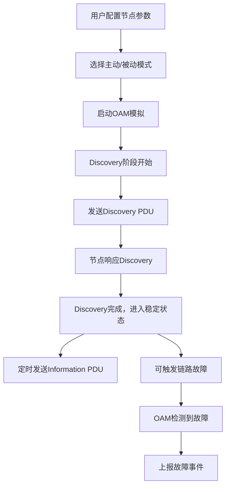

## 1. 产品概述

OAM模拟器是一个用于模拟网络运维管理（Operation, Administration, and Maintenance）协议的可视化工具，主要用于网络工程师学习和测试OAM协议的工作原理。产品模拟OAM Discovery阶段、信息PDU发送、主动/被动模式配置，并实时展示OAM状态和链路故障等事件。

### 核心价值
- 帮助网络工程师直观理解OAM协议工作流程
- 提供可视化的链路状态监控和事件追踪
- 支持主动/被动模式切换，模拟真实网络场景

## 2. 核心功能

### 2.1 功能模块
1. **OAM模拟器控制面板**：模式切换、节点配置、模拟控制
2. **链路状态可视化**：节点连接状态、Discovery进度、PDU传输动画
3. **事件日志面板**：实时显示OAM事件、链路故障告警
4. **PDU信息展示**：详细展示发送/接收的PDU报文内容

### 2.2 页面详情
| 页面名称 | 模块名称 | 功能描述 |
|-----------|-------------|---------------------|
| 主控制台 | 控制面板 | 启动/停止模拟、配置主动/被动模式、设置节点参数 |
| 主控制台 | 拓扑可视化 | 展示网络节点拓扑、链路状态、Discovery过程动画 |
| 主控制台 | 事件日志 | 实时显示OAM事件（Discovery完成、链路故障、PDU发送等） |
| 主控制台 | PDU详情 | 展示当前选中PDU的完整报文结构和字段值 |

## 3. 核心流程

### 用户操作流程
1. 用户配置两个OAM节点参数（MAC地址、模式）
2. 选择主动/被动模式
3. 启动模拟，观察Discovery阶段
4. 查看PDU发送和接收过程
5. 可触发链路故障事件，观察OAM检测机制

### Mermaid流程图

## 4. 界面设计

### 4.1 设计风格
- **主色调**：科技蓝（#165DFF）作为主色，配合深灰背景，营造网络监控系统的专业感
- **辅助色**：绿色（#00B42A）表示正常状态，红色（#F53F3F）表示故障，橙色（#FF7D00）表示警告
- **按钮风格**：圆角矩形按钮，带有微妙的悬停动画和点击反馈
- **字体**：使用 JetBrains Mono 等宽字体展示代码和报文，Inter 作为界面字体
- **布局风格**：网格化布局，左侧控制面板，中间拓扑图，右侧日志面板
- **视觉元素**：使用网络节点图标、连接线动画、脉冲效果表示数据传输

### 4.2 页面设计概览
| 页面名称 | 模块名称 | UI元素 |
|-----------|-------------|-------------|
| 主控制台 | 控制面板 | 表单输入、开关切换、按钮组、状态指示器 |
| 主控制台 | 拓扑可视化 | SVG节点图形、连接线、动画效果、状态标签 |
| 主控制台 | 事件日志 | 时间序列列表、颜色编码、滚动自动定位 |
| 主控制台 | PDU详情 | 树形结构、字段高亮、代码块展示 |

### 4.3 响应式设计
- 采用桌面优先设计，支持1200px以上屏幕
- 平板设备自动调整面板布局为上下排列
- 移动端简化为单面板Tab切换

### 4.4 动画效果
- 页面加载时的面板渐入动画
- PDU传输时的连线脉冲动画
- 状态变化时的颜色过渡效果
- 新事件添加时的滑入动画
- 链路故障时的闪烁告警效果
