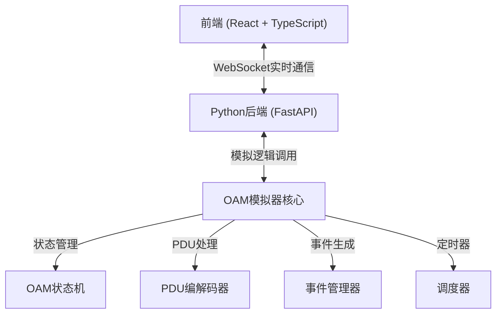
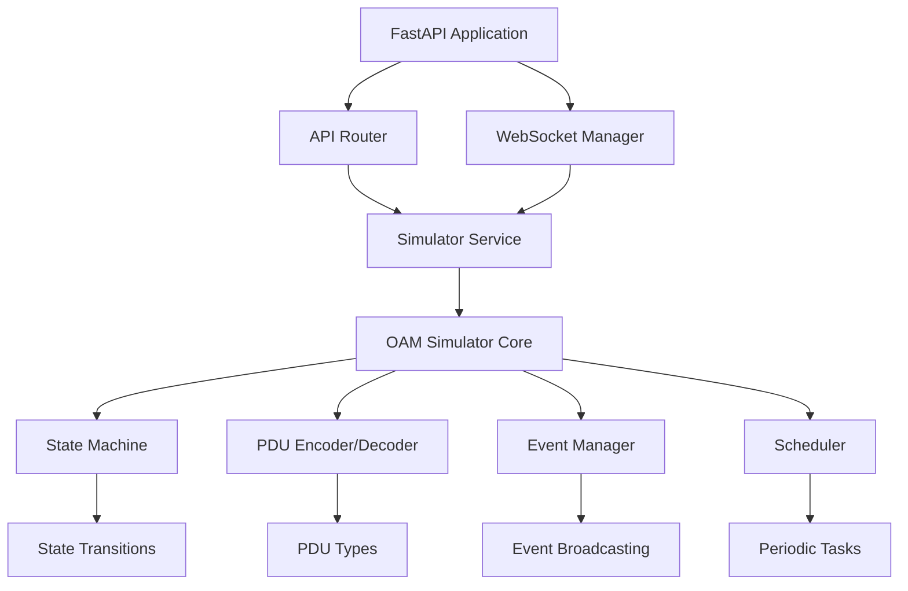
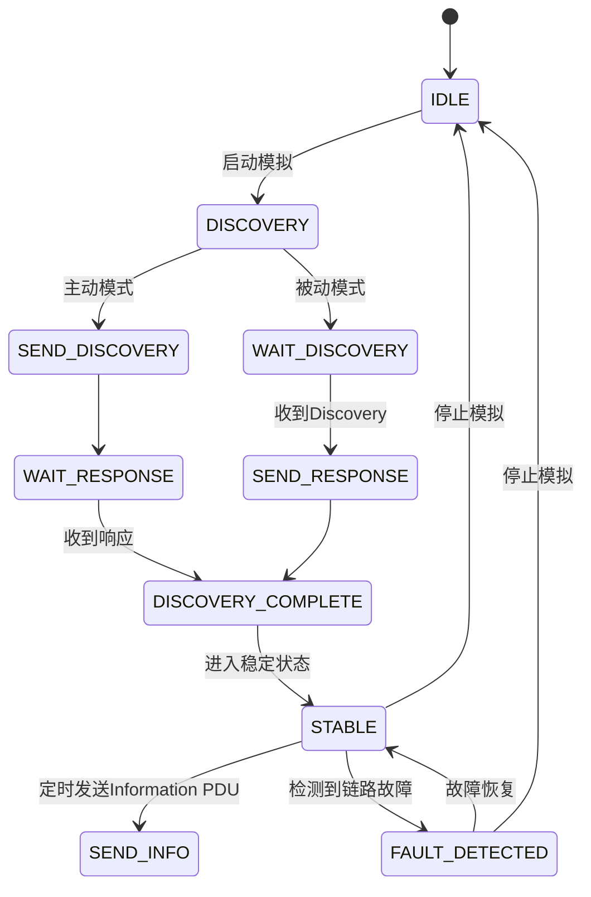

## 1. 架构设计



## 2. 技术选型

### 前端技术栈
- **框架**: React@18 + TypeScript
- **构建工具**: Vite@5
- **样式**: TailwindCSS@3
- **状态管理**: React Hooks (useState, useEffect, useCallback)
- **WebSocket**: 原生 WebSocket API
- **可视化**: 原生 SVG + CSS 动画
- **图标**: Lucide React

### 后端技术栈
- **Web框架**: FastAPI@0.109
- **WebSocket支持**: FastAPI WebSocket
- **异步处理**: asyncio
- **数据序列化**: Pydantic@2
- **类型提示**: 完整的Python类型注解

## 3. 目录结构

### 后端目录
```
backend/
├── oam_simulator/
│   ├── __init__.py
│   ├── core/
│   │   ├── __init__.py
│   │   ├── simulator.py      # OAM模拟器核心类
│   │   ├── state_machine.py  # OAM状态机
│   │   ├── pdu.py            # PDU定义与编解码
│   │   └── events.py         # 事件定义与管理
│   ├── api/
│   │   ├── __init__.py
│   │   ├── routes.py         # HTTP API路由
│   │   └── websocket.py      # WebSocket处理
│   ├── models/
│   │   ├── __init__.py
│   │   └── schemas.py        # Pydantic数据模型
│   └── main.py               # 应用入口
├── requirements.txt
└── run.py
```

### 前端目录
```
frontend/
├── src/
│   ├── components/
│   │   ├── ControlPanel.tsx      # 控制面板
│   │   ├── TopologyView.tsx      # 拓扑可视化
│   │   ├── EventLog.tsx          # 事件日志
│   │   ├── PduDetails.tsx        # PDU详情
│   │   └── StatusIndicator.tsx   # 状态指示器
│   ├── types/
│   │   └── index.ts              # TypeScript类型定义
│   ├── hooks/
│   │   └── useWebSocket.ts       # WebSocket Hook
│   ├── utils/
│   │   └── formatters.ts         # 格式化工具
│   ├── App.tsx
│   ├── main.tsx
│   └── index.css
├── package.json
├── tsconfig.json
└── vite.config.ts
```

## 4. API 定义

### WebSocket 消息类型

```typescript
// 客户端 -> 服务端
interface ClientMessage {
  type: 'start_simulation' | 'stop_simulation' | 'configure_node' | 
        'set_mode' | 'trigger_fault' | 'clear_fault' | 'request_state';
  payload: any;
}

// 服务端 -> 客户端
interface ServerMessage {
  type: 'state_update' | 'event' | 'pdu_sent' | 'pdu_received' | 'error';
  timestamp: number;
  payload: any;
}

// OAM节点配置
interface NodeConfig {
  id: string;
  name: string;
  macAddress: string;
  mode: 'active' | 'passive';
}

// OAM状态
interface OamState {
  simulationRunning: boolean;
  discoveryState: 'idle' | 'in_progress' | 'completed' | 'failed';
  linkStatus: 'up' | 'down' | 'fault';
  nodes: NodeConfig[];
  localState: string;
  remoteState: string;
}

// OAM事件
interface OamEvent {
  id: string;
  timestamp: number;
  type: 'info' | 'discovery' | 'pdu' | 'fault' | 'state_change';
  severity: 'info' | 'warning' | 'error';
  message: string;
  details?: any;
}

// PDU数据
interface PduData {
  id: string;
  timestamp: number;
  direction: 'sent' | 'received';
  type: 'discovery' | 'information' | 'event' | 'variable_request' | 'variable_response';
  sourceMac: string;
  destMac: string;
  fields: {
    code: number;
    flags: number;
    type: number;
    payload: any;
  };
  rawHex: string;
}
```

### HTTP API

| 方法 | 路径 | 用途 |
|------|------|------|
| GET | /api/state | 获取当前OAM状态 |
| POST | /api/configure | 配置节点参数 |
| POST | /api/mode | 设置主动/被动模式 |
| POST | /api/start | 启动模拟 |
| POST | /api/stop | 停止模拟 |
| POST | /api/fault/trigger | 触发链路故障 |
| POST | /api/fault/clear | 清除链路故障 |
| GET | /api/events | 获取历史事件列表 |
| GET | /api/pdus | 获取历史PDU列表 |
| GET | /ws | WebSocket连接端点 |

## 5. 后端架构



## 6. 核心数据模型

### 6.1 OAM 状态机状态



### 6.2 PDU 数据结构

| 字段 | 长度(字节) | 描述 |
|------|------------|------|
| Destination Address | 6 | 目的MAC地址 |
| Source Address | 6 | 源MAC地址 |
| Type/Length | 2 | 0x8809 (Slow Protocols) |
| Subtype | 1 | 0x03 (OAM) |
| Flags | 2 | 标志位 |
| Code | 1 | OAMPDU类型 |
| Data/Payload | 可变 | 数据负载 |
| FCS | 4 | 帧校验序列 |

### 6.3 OAMPDU 类型

| Code 值 | 类型 | 描述 |
|---------|------|------|
| 0x00 | Information | 信息PDU |
| 0x01 | Event Notification | 事件通知PDU |
| 0x02 | Variable Request | 变量请求PDU |
| 0x03 | Variable Response | 变量响应PDU |
| 0x04 | Loopback Control | 环回控制PDU |
