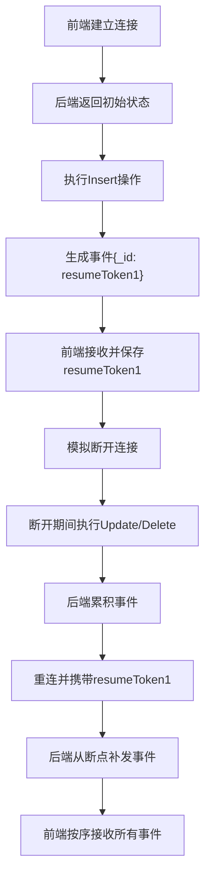

## 1. 产品概述

MongoDB Change Streams 模拟器是一个面向开发者的教学演示工具，用于直观展示 MongoDB 变更流（Change Streams）的工作原理，包括数据变更监听、断点续传机制和客户端断线重连场景。

- 主要目的：帮助开发者理解 Change Streams 的核心概念，包括 resumeToken 的作用、变更事件结构、以及客户端如何在断线后恢复监听
- 目标用户：MongoDB 开发者、数据库学习者、技术面试准备者

---

## 2. 核心功能

### 2.1 功能模块

1. **模拟控制台**：数据操作面板，模拟 Insert/Update/Delete 操作
2. **变更流监听器**：实时展示变更事件流，包含 resumeToken 显示
3. **连接状态管理器**：模拟客户端连接/断开，演示断线重连逻辑
4. **事件日志面板**：展示完整的变更事件详情和时间线

### 2.2 页面详情

| 页面名称 | 模块名称 | 功能描述 |
|-----------|-------------|---------------------|
| 主页面 | 数据操作面板 | 提供 Insert/Update/Delete 三个操作按钮，可输入测试数据执行操作 |
| 主页面 | 变更流监听器 | 实时接收并展示变更事件，高亮显示 resumeToken |
| 主页面 | 连接控制器 | 手动断开/重连按钮，重连时自动使用最后一个 resumeToken 续传 |
| 主页面 | 事件日志面板 | 列表展示所有变更事件记录，支持查看完整事件 JSON 结构 |
| 主页面 | 数据集合视图 | 展示当前模拟集合的所有文档状态 |

---

## 3. 核心流程

### 3.1 正常监听流程
1. 用户启动后端服务，初始化模拟集合
2. 前端建立 WebSocket 连接，订阅变更流
3. 用户执行 Insert/Update/Delete 操作
4. 后端生成变更事件，附带 resumeToken，推送给前端
5. 前端展示事件详情，记录最新的 resumeToken

### 3.2 断线重连流程
1. 用户点击"断开连接"按钮，模拟网络中断
2. 断开期间，用户继续执行数据操作（事件在后端累积）
3. 用户点击"恢复连接"，前端携带最后保存的 resumeToken 请求重连
4. 后端从 resumeToken 对应的位置开始，补发所有错过的事件
5. 前端按顺序接收并展示补发的事件

---

## 4. 用户界面设计

### 4.1 设计风格
- **主色调**：深绿色 (#00ED64) - MongoDB 标志性绿色，搭配深色背景
- **辅助色**：琥珀色 (#FFB000) 用于 resumeToken 高亮，红色 (#FF4D4F) 用于断开状态
- **字体**：使用 JetBrains Mono 作为代码字体，Space Grotesk 作为界面字体
- **布局**：三栏式布局，左侧数据操作区，中间变更流监听区，右侧事件日志区
- **风格**：科技感深色主题，终端风格，带数据网格背景和轻微噪点

### 4.2 页面设计概述

| 页面名称 | 模块名称 | UI 元素 |
|-----------|-------------|-------------|
| 主页面 | 数据操作面板 | 卡片式布局，操作按钮带图标和悬停动效，输入框为终端风格 |
| 主页面 | 变更流监听器 | 实时滚动列表，新事件从上方滑入，resumeToken 使用荧光高亮 |
| 主页面 | 连接控制器 | 状态指示器（绿/红），带脉冲动画，按钮有点击反馈 |
| 主页面 | 事件日志面板 | 表格展示事件类型、时间、resumeToken，支持展开查看 JSON |
| 主页面 | 数据集合视图 | 代码块风格展示当前集合文档，更新时有高亮闪烁 |

### 4.3 响应式
- 桌面端三栏布局，平板端两栏，移动端单栏垂直堆叠
- 触控区域不小于 44px，移动端按钮放大

---
