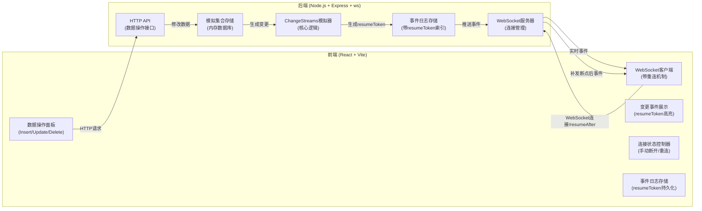
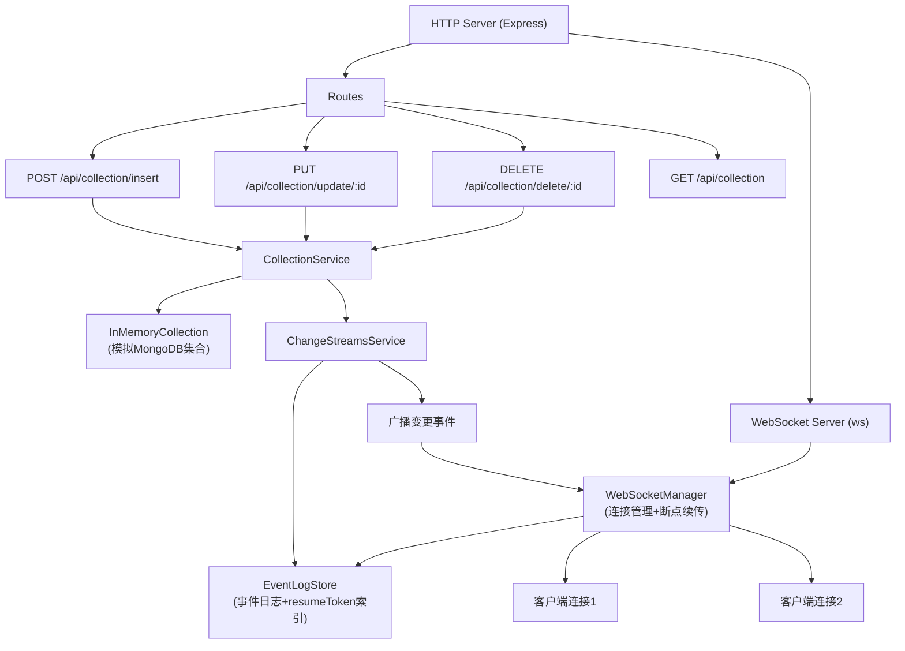

## 1. 架构设计



---

## 2. 技术描述

- **前端**：React@18 + TypeScript + TailwindCSS@3 + Vite@5
- **后端**：Node.js@20 + Express@4 + ws@8 (WebSocket库)
- **数据存储**：后端内存存储（模拟MongoDB集合）
- **通信协议**：HTTP + WebSocket
- **初始化工具**：npm create vite@latest (前端) + 手动搭建后端

---

## 3. 目录结构

```
p360/
├── client/                 # 前端项目
│   ├── src/
│   │   ├── components/     # UI组件
│   │   ├── hooks/          # 自定义hooks
│   │   ├── types/          # TypeScript类型定义
│   │   └── App.tsx
│   ├── package.json
│   └── vite.config.ts
├── server/                 # 后端项目
│   ├── src/
│   │   ├── models/         # 数据模型
│   │   ├── services/       # 业务逻辑
│   │   ├── routes/         # API路由
│   │   ├── websocket/      # WebSocket处理
│   │   └── index.ts        # 入口文件
│   └── package.json
└── .trae/documents/        # 项目文档
```

---

## 4. 核心数据结构

### 4.1 ResumeToken 定义
```typescript
/**
 * 恢复令牌，用于断点续传
 * 格式模拟 MongoDB 的 BinData
 */
interface ResumeToken {
  _data: string; // Base64 编码的时间戳 + 序列号
}

// 生成规则: Base64.encode(`${timestamp}:${sequence}`)
// 例如: "MTcxNzIwMDAwMDAwMDox" -> 时间戳1717200000000, 序列号1
```

### 4.2 ChangeEvent 变更事件
```typescript
/**
 * 变更事件结构（参考 MongoDB Change Streams）
 */
interface ChangeEvent {
  _id: ResumeToken;          // 事件ID = resumeToken
  operationType: 'insert' | 'update' | 'delete'; // 操作类型
  clusterTime: Timestamp;    // 集群时间
  ns: {
    db: string;              // 数据库名
    coll: string;            // 集合名
  };
  documentKey: {
    _id: string;             // 文档ID
  };
  fullDocument?: Document;   // insert/update 时的完整文档
  updateDescription?: {      // update 时的变更描述
    updatedFields: Record<string, any>;
    removedFields: string[];
  };
}
```

### 4.3 模拟文档 (Document)
```typescript
interface Document {
  _id: string;               // UUID
  [key: string]: any;        // 自定义字段
  _createdAt: number;        // 创建时间
  _updatedAt: number;        // 更新时间
}
```

---

## 5. API 定义

### 5.1 HTTP API

| 方法 | 路径 | 描述 | 请求体 | 响应 |
|------|------|------|--------|------|
| POST | `/api/collection/insert` | 插入文档 | `{ data: object }` | `{ success: boolean, document: Document }` |
| PUT | `/api/collection/update/:id` | 更新文档 | `{ data: object }` | `{ success: boolean, document: Document }` |
| DELETE | `/api/collection/delete/:id` | 删除文档 | - | `{ success: boolean, documentId: string }` |
| GET | `/api/collection` | 获取所有文档 | - | `{ documents: Document[] }` |
| GET | `/api/events` | 获取历史事件 | `?resumeAfter?: string` | `{ events: ChangeEvent[] }` |

### 5.2 WebSocket 消息协议

**客户端 -> 服务器**
```typescript
// 1. 初始连接消息
interface ConnectMessage {
  type: 'connect';
  resumeAfter?: string; // 可选，resumeToken 的 _data 值
}

// 2. 断开消息（模拟）
interface DisconnectMessage {
  type: 'disconnect';
}
```

**服务器 -> 客户端**
```typescript
// 1. 变更事件推送
interface EventMessage {
  type: 'change';
  event: ChangeEvent;
  isResumed: boolean; // 是否为重连补发的事件
}

// 2. 连接确认
interface ConnectedMessage {
  type: 'connected';
  startingToken?: string; // 起始 resumeToken
  missedEventCount?: number; // 补发事件数量
}

// 3. 补发完成通知
interface ResumeCompleteMessage {
  type: 'resumeComplete';
  totalResumed: number;
}
```

---

## 6. 核心算法

### 6.1 Change Streams 模拟器核心逻辑

```typescript
class ChangeStreamsSimulator {
  private eventLog: ChangeEvent[] = [];  // 事件日志（持久化）
  private sequence = 0;                  // 事件序列号

  // 生成 resumeToken
  private generateResumeToken(): ResumeToken {
    const timestamp = Date.now();
    this.sequence++;
    const data = `${timestamp}:${this.sequence}`;
    return { _data: Buffer.from(data).toString('base64') };
  }

  // 解析 resumeToken 获取时间戳和序列号
  private parseResumeToken(token: string): { timestamp: number; sequence: number } {
    const decoded = Buffer.from(token, 'base64').toString();
    const [timestamp, sequence] = decoded.split(':');
    return { timestamp: parseInt(timestamp), sequence: parseInt(sequence) };
  }

  // 创建变更事件
  createEvent(
    operationType: 'insert' | 'update' | 'delete',
    doc: Document,
    updateDescription?: any
  ): ChangeEvent {
    const token = this.generateResumeToken();
    const event: ChangeEvent = {
      _id: token,
      operationType,
      clusterTime: new Timestamp(Date.now() / 1000, this.sequence),
      ns: { db: 'test', coll: 'simulation' },
      documentKey: { _id: doc._id },
      ...(operationType !== 'delete' && { fullDocument: doc }),
      ...(operationType === 'update' && { updateDescription }),
    };
    this.eventLog.push(event);
    return event;
  }

  // 获取指定 resumeToken 之后的所有事件（断点续传）
  getEventsAfter(resumeToken?: string): ChangeEvent[] {
    if (!resumeToken) return this.eventLog;
    const { sequence } = this.parseResumeToken(resumeToken);
    return this.eventLog.filter(event => {
      const eventSeq = this.parseResumeToken(event._id._data).sequence;
      return eventSeq > sequence;
    });
  }
}
```

### 6.2 前端重连机制

```typescript
function useChangeStreams() {
  const [lastToken, setLastToken] = useState<string | null>(null);
  const [isConnected, setIsConnected] = useState(false);
  const [isManuallyDisconnected, setIsManuallyDisconnected] = useState(false);

  // 连接 WebSocket
  const connect = useCallback(() => {
    const ws = new WebSocket('ws://localhost:3001');
    
    ws.onopen = () => {
      // 发送连接消息，携带 lastToken
      ws.send(JSON.stringify({
        type: 'connect',
        resumeAfter: lastToken || undefined
      }));
      setIsConnected(true);
      setIsManuallyDisconnected(false);
    };

    ws.onmessage = (e) => {
      const msg = JSON.parse(e.data);
      if (msg.type === 'change') {
        // 更新 lastToken
        setLastToken(msg.event._id._data);
        // 处理事件...
      }
    };

    ws.onclose = () => {
      setIsConnected(false);
      // 如果不是手动断开，自动重连
      if (!isManuallyDisconnected) {
        setTimeout(connect, 2000);
      }
    };
  }, [lastToken, isManuallyDisconnected]);

  // 手动断开
  const disconnect = () => {
    setIsManuallyDisconnected(true);
    // 关闭连接...
  };

  return { connect, disconnect, isConnected, lastToken };
}
```

---

## 7. 服务器架构



---
