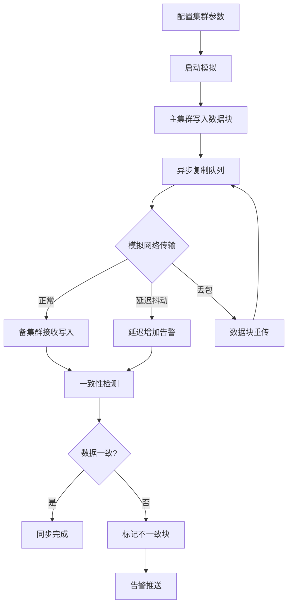

## 1. 产品概述

RBD镜像同步模拟器是一个可视化工具，用于模拟Ceph RBD（RADOS Block Device）主集群与备集群之间的异步块数据复制过程。该模拟器能够模拟网络延迟、带宽波动等真实场景，实时检测数据不一致问题，并通过直观的Web界面展示同步进度、延迟指标和一致性状态。

- **目标用户**：存储系统管理员、Ceph运维工程师、分布式存储研究人员
- **核心价值**：在不影响生产环境的前提下，直观理解RBD异步复制行为，辅助排查数据同步问题

## 2. 核心功能

### 2.1 功能模块

1. **集群拓扑视图**：可视化展示主集群与备集群的拓扑结构，包含OSD节点、Pool和RBD Image
2. **同步进度监控**：实时展示块数据的同步进度条、已同步/未同步数据量、同步速率
3. **网络延迟模拟**：可配置的网络延迟参数（基础延迟、抖动、丢包率），实时显示延迟曲线
4. **数据一致性检测**：对比主备集群块数据，标记不一致的块，展示差异详情
5. **事件日志**：记录所有同步事件、延迟异常、数据不一致告警

### 2.2 页面详情

| 页面名称 | 模块名称 | 功能描述 |
|---------|---------|---------|
| 仪表盘 | 集群拓扑视图 | 展示主集群和备集群的节点拓扑，实时高亮正在同步的数据块路径 |
| 仪表盘 | 同步进度面板 | 显示每个RBD Image的同步进度条、速率、预计剩余时间 |
| 仪表盘 | 延迟监控面板 | 实时网络延迟折线图，显示RTT、抖动、丢包率指标 |
| 仪表盘 | 一致性检测面板 | 块级别对比结果，热力图展示不一致块分布 |
| 控制台 | 参数配置 | 配置延迟参数、带宽限制、数据块大小、镜像数量 |
| 控制台 | 事件日志 | 滚动展示所有同步事件和告警信息 |

## 3. 核心流程

1. 用户配置集群参数（节点数、延迟、带宽、镜像大小）
2. 启动模拟，主集群开始异步写入数据块
3. 数据块通过模拟网络（含延迟和抖动）传输到备集群
4. 同步进度实时更新，延迟曲线实时绘制
5. 一致性检测器定期扫描主备差异，标记不一致块
6. 告警事件推送至事件日志

## 4. 用户界面设计

### 4.1 设计风格

- **主色调**：深色工业风（#0A0E17 底色），搭配青色（#00F0FF）和橙红色（#FF4D4D）作为功能色
- **辅助色**：深蓝灰（#1A1F2E）、翠绿（#00FF88）用于成功/同步状态
- **按钮风格**：圆角微光按钮，hover时边框发光效果
- **字体**：JetBrains Mono（数据/代码），Noto Sans SC（中文UI文本）
- **布局风格**：左侧导航栏 + 主内容区，卡片式面板布局
- **图标风格**：线性图标（Lucide），2px描边

### 4.2 页面设计概览

| 页面名称 | 模块名称 | UI元素 |
|---------|---------|---------|
| 仪表盘 | 集群拓扑视图 | 深色背景Canvas动画，节点发光连线，数据流动粒子效果 |
| 仪表盘 | 同步进度面板 | 渐变进度条，数字翻牌动画，速率仪表盘 |
| 仪表盘 | 延迟监控面板 | 实时折线图（暗色主题），延迟区间色带（绿/黄/红） |
| 仪表盘 | 一致性检测面板 | 块网格热力图，红/绿色块标记一致/不一致，差异详情弹窗 |
| 控制台 | 参数配置 | 滑块控件，数值输入框，开关按钮，预设方案选择器 |
| 控制台 | 事件日志 | 终端风格滚动列表，彩色日志级别标签，时间戳 |

### 4.3 响应式设计

- 桌面优先设计，仪表盘在宽屏下采用多列网格布局
- 中等屏幕下延迟和一致性面板折叠为标签页
- 小屏幕下侧边栏收起为汉堡菜单

### 4.4 动效设计

- 集群拓扑：数据流动粒子沿连线移动，节点脉冲呼吸效果
- 同步进度：进度条填充带扫描线动效，数字变化带过渡动画
- 延迟曲线：实时滚动更新，异常区间红色闪烁
- 一致性检测：不一致块出现时红色闪烁 + 涟漪扩散效果
- 页面加载：面板依次淡入，带错落延迟
