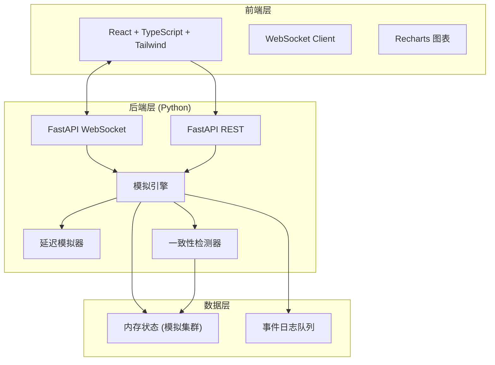
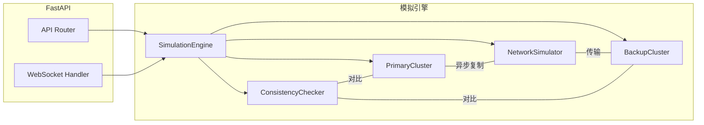
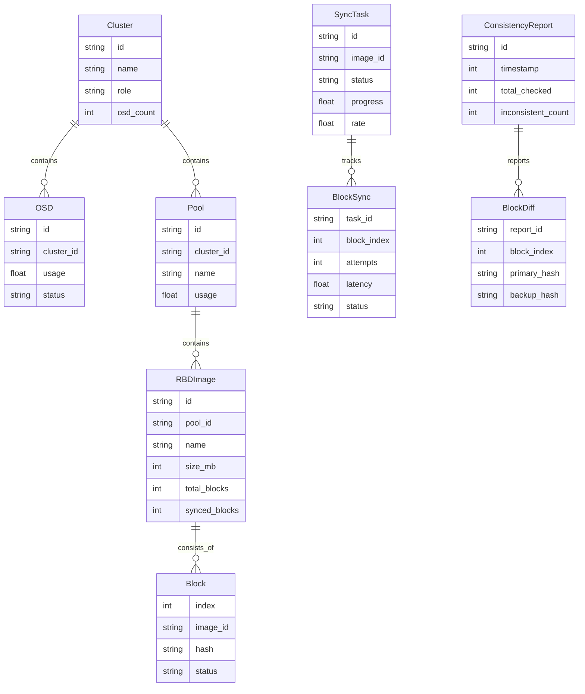

## 1. 架构设计



## 2. 技术说明

- **前端**：React@18 + TypeScript + Tailwind CSS@3 + Vite
- **初始化工具**：vite-init（react-ts模板）
- **后端**：Python FastAPI + WebSocket
- **图表**：Recharts（延迟曲线、同步速率图）
- **数据**：内存模拟，无持久化数据库
- **实时通信**：WebSocket推送同步状态、延迟数据、一致性检测结果

## 3. 路由定义

| 路由 | 用途 |
|------|------|
| / | 仪表盘主页面，展示集群拓扑、同步进度、延迟监控、一致性检测 |
| /console | 控制台页面，参数配置和事件日志 |

## 4. API 定义

### 4.1 REST API

| 方法 | 路径 | 说明 |
|------|------|------|
| GET | /api/status | 获取模拟器整体状态 |
| POST | /api/simulate/start | 启动模拟 |
| POST | /api/simulate/stop | 停止模拟 |
| POST | /api/simulate/pause | 暂停模拟 |
| PUT | /api/config | 更新模拟参数配置 |
| GET | /api/config | 获取当前配置 |
| POST | /api/consistency/check | 触发一致性检测 |
| GET | /api/logs | 获取事件日志（分页） |

### 4.2 WebSocket 消息类型

```typescript
interface SyncProgressMessage {
  type: "sync_progress"
  images: Array<{
    id: string
    name: string
    totalBlocks: number
    syncedBlocks: number
    rate: number
    eta: number
  }>
}

interface LatencyMessage {
  type: "latency"
  timestamp: number
  rtt: number
  jitter: number
  packetLoss: number
}

interface ConsistencyMessage {
  type: "consistency"
  inconsistentBlocks: Array<{
    imageId: string
    blockIndex: number
    primaryHash: string
    backupHash: string
  }>
  totalChecked: number
  inconsistentCount: number
}

interface LogMessage {
  type: "log"
  level: "info" | "warn" | "error"
  message: string
  timestamp: number
}

interface ClusterStatusMessage {
  type: "cluster_status"
  primary: { osds: number; poolUsage: number; iops: number }
  backup: { osds: number; poolUsage: number; iops: number }
}
```

### 4.3 配置参数

```typescript
interface SimConfig {
  blockSize: number        // 块大小 (KB), 默认 4096
  imageSize: number        // 镜像大小 (MB), 默认 1024
  imageCount: number       // 镜像数量, 默认 3
  baseLatency: number      // 基础延迟 (ms), 默认 50
  jitterRange: number      // 抖动范围 (ms), 默认 30
  packetLossRate: number   // 丢包率 (0-1), 默认 0.02
  bandwidth: number        // 带宽限制 (MB/s), 默认 100
  primaryOsds: number      // 主集群OSD数量, 默认 6
  backupOsds: number       // 备集群OSD数量, 默认 6
  consistencyInterval: number  // 一致性检测间隔 (s), 默认 5
}
```

## 5. 后端架构图



## 6. 数据模型

### 6.1 核心数据模型


