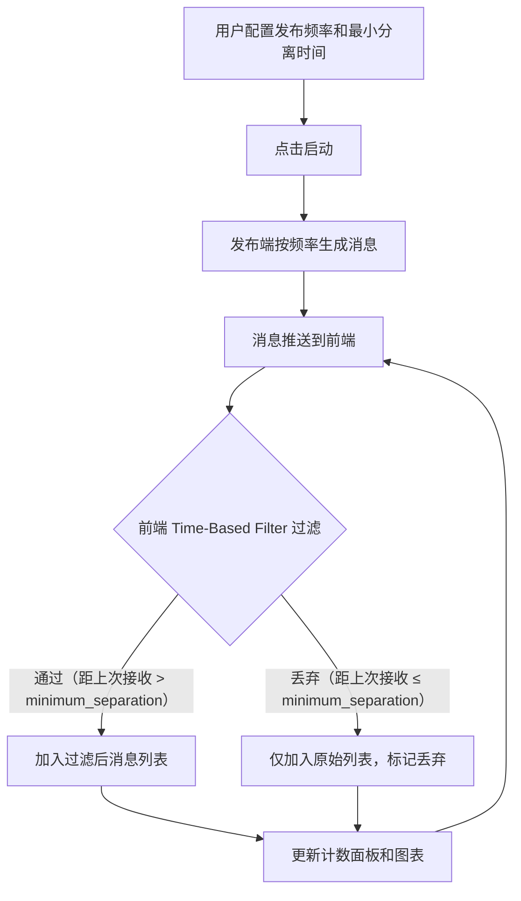

## 1. 产品概述

DDS（Data Distribution Service）Time-Based Filter 模拟器，用于可视化演示 DDS 中基于时间的过滤策略。发布端以指定频率发送消息，订阅端通过最小分离时间（minimum_separation）过滤，仅接收间隔大于指定阈值的数据样本，前端实时展示过滤前后的消息数量对比。

- 面向 DDS 协议学习者与中间件开发者，帮助直观理解 QoS 策略中 Time-Based Filter 的工作机制
- 核心价值：将抽象的 QoS 过滤逻辑转化为可视、可交互的演示工具

## 2. 核心功能

### 2.1 功能模块

1. **控制面板页**：发布端频率配置、最小分离时间配置、启停控制、实时消息计数
2. **消息监控页**：过滤前后消息流实时对比、消息时间线可视化

### 2.2 页面详情

| 页面名称 | 模块名称 | 功能描述 |
|----------|----------|----------|
| 仪表盘 | 发布端配置 | 设置发布消息频率（消息/秒）、启动/停止发布 |
| 仪表盘 | 过滤器配置 | 设置最小分离时间（毫秒），即 Time-Based Filter 的 minimum_separation |
| 仪表盘 | 实时计数面板 | 显示已发送消息总数、过滤后接收消息数、过滤丢弃数，带环形进度图 |
| 仪表盘 | 消息时间线 | 左右双列展示：左侧为原始消息流，右侧为过滤后消息流，每条消息显示序号和时间戳 |
| 仪表盘 | 统计图表 | 折线图展示过滤前后的消息频率随时间变化趋势 |

## 3. 核心流程

用户在控制面板配置发布频率和最小分离时间，点击启动后，发布端按配置频率生成消息并推送到前端。前端同时维护两个消息列表：原始消息列表（全部接收）和过滤后消息列表（仅展示满足最小分离时间的消息）。实时计数和图表同步更新。

## 4. 用户界面设计

### 4.1 设计风格

- 主色调：深色科技风（#0A0E17 背景，#00E5A0 绿色荧光强调色，#FF6B6B 丢弃警告色）
- 辅助色：#1A1F2E 面板背景，#2A3040 边框
- 字体：JetBrains Mono（数据展示），Noto Sans SC（中文界面）
- 布局：深色仪表盘风格，卡片式模块布局
- 动画：消息流入动画、计数器跳动、图表平滑过渡

### 4.2 页面设计概览

| 页面名称 | 模块名称 | UI 元素 |
|----------|----------|----------|
| 仪表盘 | 发布端配置 | 暗色卡片，滑块控件设置频率，圆形启动/停止按钮 |
| 仪表盘 | 过滤器配置 | 暗色卡片，数字输入框设置最小分离时间(ms)，实时预览效果 |
| 仪表盘 | 实时计数面板 | 三个数据卡片：已发送/已接收/已丢弃，带环形进度指示器 |
| 仪表盘 | 消息时间线 | 双列瀑布流，左侧绿色标记通过，右侧红色标记丢弃 |
| 仪表盘 | 统计图表 | 折线图，双线对比过滤前后频率 |

### 4.3 响应式设计

- 桌面优先，宽屏下三列布局
- 平板适配为两列
- 移动端单列堆叠
