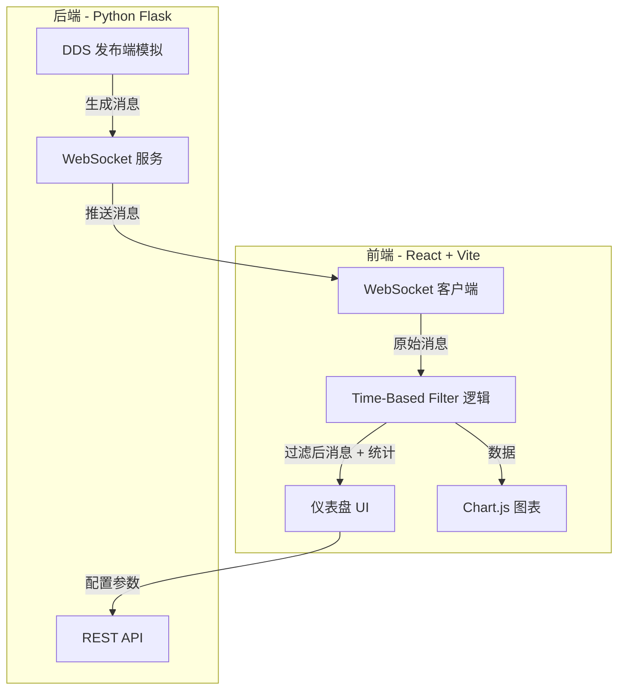

## 1. 架构设计



## 2. 技术说明

- 前端：React@18 + TailwindCSS@3 + Vite
- 初始化工具：Vite init
- 后端：Python Flask + flask-socketio（WebSocket 实时通信）
- 数据库：无（纯实时模拟，无需持久化）
- 图表：Chart.js（折线图展示频率趋势）

## 3. 路由定义

| 路由 | 用途 |
|------|------|
| / | 仪表盘主页面（所有功能集成） |

## 4. API 定义

### 4.1 REST API

```
POST /api/start
  Request: { "publish_rate": number, "min_separation_ms": number }
  Response: { "status": "ok", "session_id": string }

POST /api/stop
  Request: {}
  Response: { "status": "ok" }

GET /api/status
  Response: { "running": boolean, "publish_rate": number, "min_separation_ms": number, "sent_count": number, "received_count": number, "dropped_count": number }
```

### 4.2 WebSocket 事件

```
服务端推送:
  "message" -> { "id": number, "timestamp": number, "data": string }

客户端发送:
  "configure" -> { "publish_rate": number, "min_separation_ms": number }
```

## 5. Time-Based Filter 核心逻辑

```
last_received_time = None

def should_deliver(message):
    global last_received_time
    if last_received_time is None:
        last_received_time = message.timestamp
        return True
    elapsed = message.timestamp - last_received_time
    if elapsed >= min_separation_ms:
        last_received_time = message.timestamp
        return True
    return False
```

## 6. 数据模型

无需数据库，前端内存中维护：
- messages: 全部消息列表（id, timestamp, delivered: boolean）
- stats: 实时统计数据（sent_count, received_count, dropped_count）
- rate_history: 频率历史（用于折线图）
