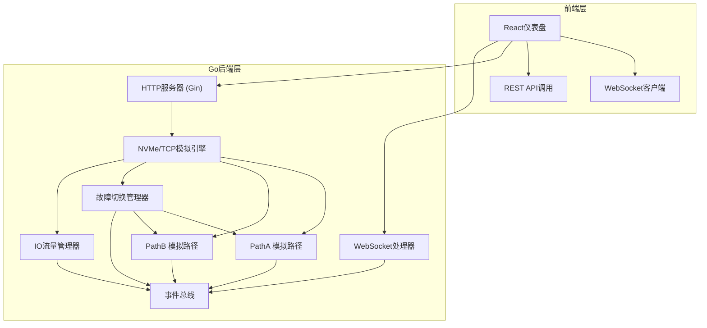
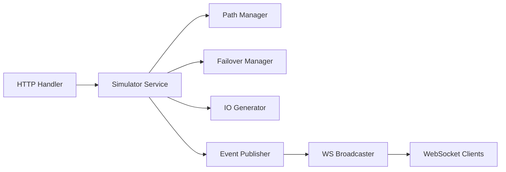
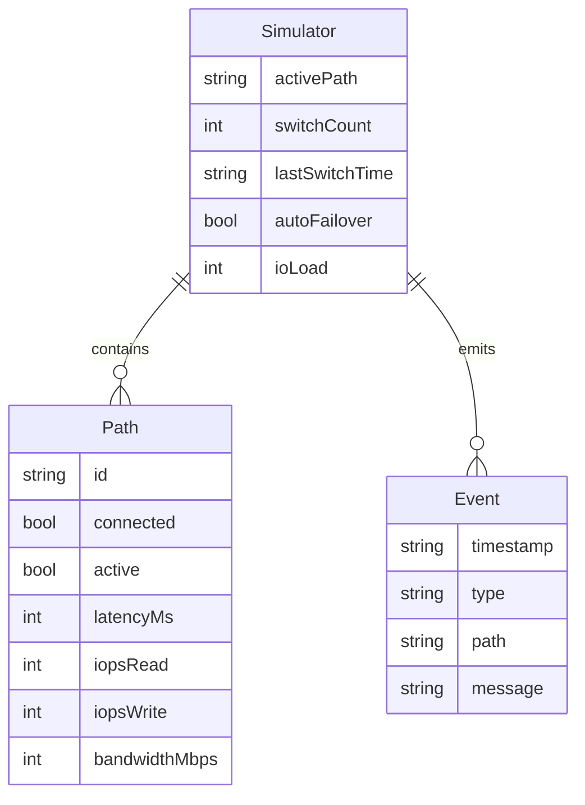

## 1. 架构设计



## 2. 技术说明

- 前端：React 18 + TypeScript + TailwindCSS 3 + Vite
- 初始化工具：Vite (create-vite)
- 后端：Go 1.22+ + Gin + gorilla/websocket
- 数据库：无（内存状态，模拟数据）
- 通信：REST API（控制操作） + WebSocket（实时状态推送）

## 3. 路由定义

| 路由 | 用途 |
|------|------|
| `/` | 仪表盘主页面 |
| `/api/status` | 获取当前路径状态、切换计数 |
| `/api/path/:id/disconnect` | 断开指定路径 |
| `/api/path/:id/connect` | 恢复指定路径 |
| `/api/failover/toggle` | 开关自动故障注入 |
| `/api/io/load` | 调节IO负载强度 |
| `/ws` | WebSocket实时推送事件 |

## 4. API定义

### 4.1 数据类型

```typescript
type PathID = "pathA" | "pathB"

interface PathStatus {
  id: PathID
  connected: boolean
  active: boolean
  latency_ms: number
  iops_read: number
  iops_write: number
  bandwidth_mbps: number
}

interface SimulatorStatus {
  paths: PathStatus[]
  active_path: PathID
  switch_count: number
  last_switch_time: string | null
  last_switch_direction: string | null
  auto_failover: boolean
  io_load_percent: number
}

interface Event {
  timestamp: string
  type: "connect" | "disconnect" | "switch" | "recover" | "io_resume"
  path: PathID
  message: string
}

type WSMessage =
  | { type: "status"; data: SimulatorStatus }
  | { type: "event"; data: Event }
  | { type: "io_tick"; data: { pathA: number; pathB: number; timestamp: number } }
```

### 4.2 请求/响应

| 端点 | 方法 | 请求 | 响应 |
|------|------|------|------|
| `/api/status` | GET | - | `SimulatorStatus` |
| `/api/path/:id/disconnect` | POST | - | `{ success: bool }` |
| `/api/path/:id/connect` | POST | - | `{ success: bool }` |
| `/api/failover/toggle` | POST | `{ enabled: bool }` | `{ enabled: bool }` |
| `/api/io/load` | POST | `{ percent: number }` | `{ percent: number }` |

## 5. 服务器架构图



## 6. 数据模型

### 6.1 数据模型定义

全部为内存数据结构，无需持久化。



### 6.2 核心逻辑：故障切换流程

1. 客户端同时连接PathA和PathB
2. 默认PathA为活动路径，PathB为备用
3. IO请求通过活动路径发送
4. 当活动路径断开时：
   - 故障检测器发现连接断开
   - 自动切换到备用路径（切换计数+1）
   - IO请求无缝重定向到新活动路径
   - 推送switch事件和新的status到前端
5. 当断开路径恢复时：
   - 推送recover事件
   - 保持当前活动路径不变，恢复路径成为新备用
6. 自动故障注入模式：随机间隔断开/恢复路径以演示切换
