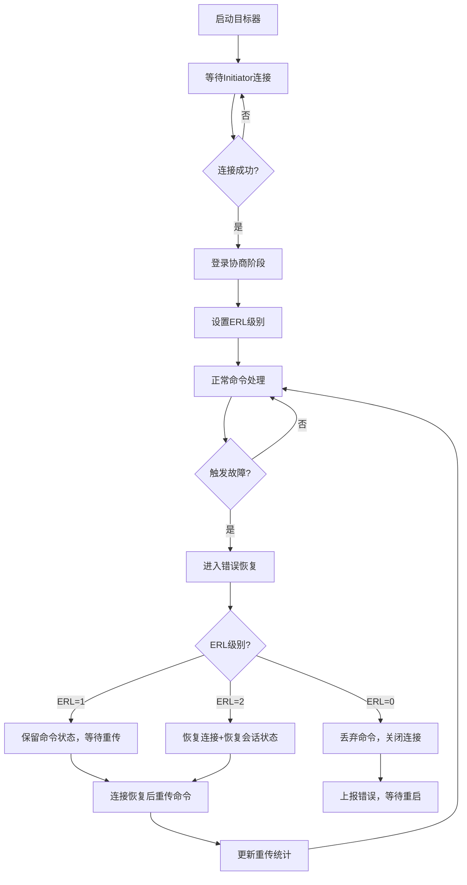

## 1. 产品概述

iSCSI目标器模拟器，用于演示和测试iSCSI协议的错误恢复机制。支持ERL=0/1/2三种错误恢复级别，可模拟网络连接故障，实现命令重发和状态恢复，并通过Web界面实时展示重传次数和连接状态。

- 核心目的：提供可视化的iSCSI错误恢复学习和测试平台
- 解决问题：iSCSI协议错误恢复机制难以直观理解和调试
- 目标用户：存储工程师、网络协议学习者、QA测试人员
- 产品价值：降低iSCSI错误恢复的学习成本，提供可重复的测试场景

## 2. 核心 Features

### 2.1 用户角色

| 角色 | 注册方式 | 核心权限 |
|------|----------|----------|
| 管理员 | 本地访问 | 配置ERL级别、触发故障模拟、查看监控数据 |

### 2.2 Feature Module

1. **监控面板页**：连接状态概览、重传统计、实时日志
2. **控制中心页**：ERL级别切换、故障模拟控制、目标器启停
3. **命令详情页**：命令执行历史、重传记录、状态转换时间线

### 2.3 页面详情

| 页面名称 | 模块名称 | Feature 描述 |
|----------|----------|--------------|
| 监控面板 | 状态卡片 | 实时显示连接状态（已连接/断开/恢复中）、当前ERL级别、运行时长 |
| 监控面板 | 统计卡片 | 总命令数、成功命令数、重传次数、失败命令数，支持数字滚动动画 |
| 监控面板 | 实时日志 | 滚动展示iSCSI PDU交互日志，支持按级别过滤 |
| 控制中心 | ERL选择器 | 切换ERL=0/1/2三种错误恢复级别，显示各模式说明 |
| 控制中心 | 故障控制 | 手动触发连接故障、设置自动故障概率、恢复连接 |
| 控制中心 | 目标器控制 | 启动/停止iSCSI目标器服务，配置监听端口和IQN |
| 命令详情 | 命令列表 | 展示所有执行过的SCSI命令，包括CMD、DATA、R2T等PDU类型 |
| 命令详情 | 时间线 | 可视化展示命令生命周期，标注重传点和状态转换 |

## 3. 核心流程

### 3.1 正常命令执行流程
用户启动iSCSI目标器 → Initiator连接 → 登录协商 → 发送SCSI命令 → 目标器处理 → 返回响应 → 命令完成

### 3.2 故障恢复流程（ERL=1）
命令执行中 → 触发连接故障 → 检测到超时 → 标记命令待重传 → 连接恢复 → 重新发送命令 → 完成执行 → 重传计数+1

### 3.3 故障恢复流程（ERL=2）
连接故障 → 断开所有连接 → 保留命令状态 → 重新建立连接 → 恢复会话状态 → 继续未完成命令 → 状态同步完成

## 4. 用户界面设计

### 4.1 设计风格
- **主题色**：深空蓝（#0f172a）作为主背景，科技感蓝绿色（#06b6d4）作为主色，警告橙（#f59e0b）和危险红（#ef4444）作为状态色
- **按钮风格**：圆角8px，带有微妙的阴影和hover发光效果
- **字体**：使用JetBrains Mono作为等宽字体展示日志和数据，Space Grotesk作为标题字体
- **布局风格**：网格化仪表盘布局，卡片带有玻璃态效果（backdrop-filter）
- **图标风格**：使用lucide-react线性图标，状态指示使用带发光效果的圆点

### 4.2 页面设计概述

| 页面名称 | 模块名称 | UI Elements |
|----------|----------|-------------|
| 监控面板 | 状态卡片 | 渐变背景，状态指示器带有脉冲动画，数字滚动效果 |
| 监控面板 | 实时日志 | 深色终端风格，支持关键字高亮，自动滚动 |
| 控制中心 | ERL选择器 | 三段式切换开关，选中项有发光边框，附带说明tooltip |
| 控制中心 | 故障控制 | 危险按钮带有红色光晕，滑块控件调节故障概率 |
| 命令详情 | 时间线 | 垂直时间线，节点带有不同颜色标识状态，悬停显示详情 |

### 4.3 响应性
- 采用桌面优先设计，主内容区域最小宽度1200px
- 在平板设备上自适应为两列布局
- 在移动设备上单列堆叠，导航转为抽屉式
- 所有交互元素支持触摸操作

### 4.4 动效设计
- 页面加载时卡片依次淡入（staggered reveal）
- 状态变化时数字平滑过渡
- 连接状态指示器使用脉冲动画表示活跃状态
- 新日志条目滑入效果
- 按钮hover时轻微上浮和发光
