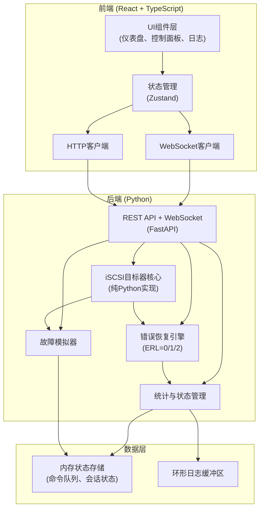
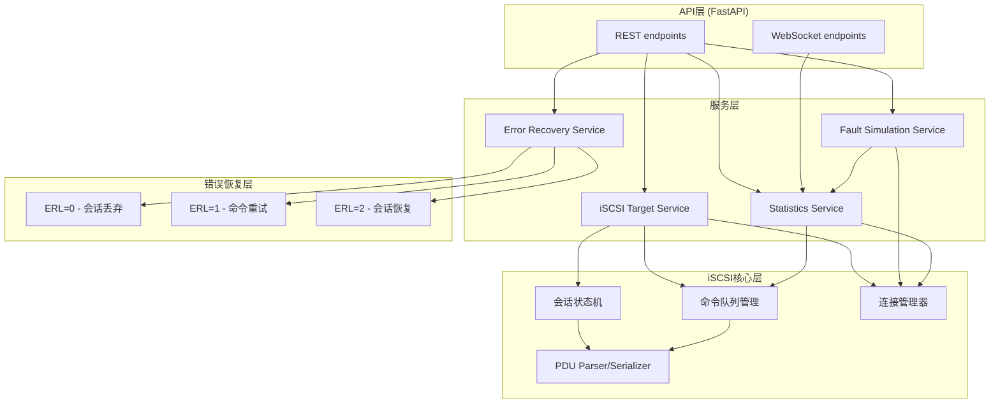
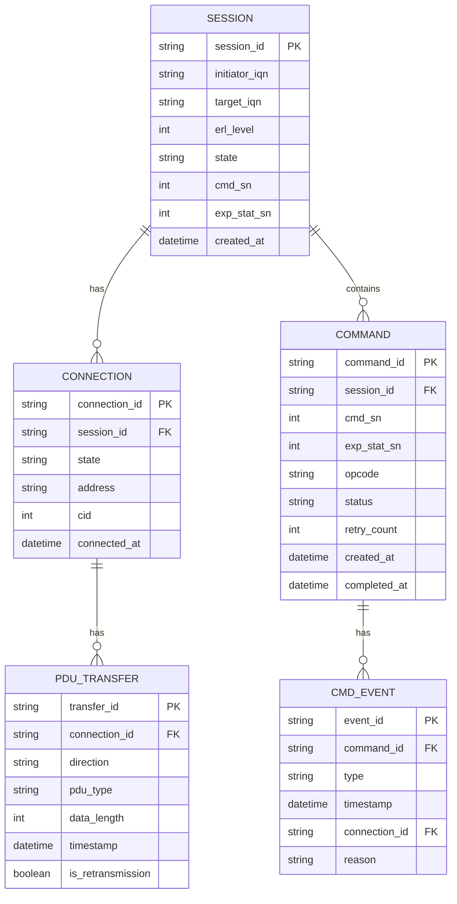

## 1. 架构设计



## 2. 技术描述

- **前端**：React@18 + TypeScript + Vite + Tailwind CSS@3 + Zustand + lucide-react
- **初始化工具**：vite-init
- **后端**：Python 3.10+ + FastAPI + uvicorn + websockets
- **iSCSI实现**：纯Python实现，基于RFC 3720规范
- **数据存储**：内存存储（无需持久化数据库），使用asyncio.Queue管理命令队列

## 3. 路由定义

| 路由 | 用途 |
|------|------|
| / | 监控面板（首页） |
| /control | 控制中心 |
| /commands | 命令详情 |
| /api/status | 获取目标器状态 |
| /api/stats | 获取统计数据 |
| /api/erl | 设置ERL级别 |
| /api/fault | 触发/停止故障模拟 |
| /api/target/start | 启动目标器 |
| /api/target/stop | 停止目标器 |
| /ws/logs | 实时日志WebSocket |
| /ws/stats | 统计数据WebSocket |

## 4. API 定义

```typescript
// 状态类型定义
interface TargetStatus {
  isRunning: boolean;
  connectionState: 'disconnected' | 'connecting' | 'connected' | 'recovering' | 'fault';
  erlLevel: 0 | 1 | 2;
  uptime: number;
  initiatorIQN: string | null;
  targetIQN: string;
  listenAddress: string;
}

interface Statistics {
  totalCommands: number;
  successfulCommands: number;
  retransmittedCommands: number;
  failedCommands: number;
  totalRetries: number;
  activeCommands: number;
  faultCount: number;
  recoveryCount: number;
  averageRecoveryTime: number;
}

interface ISCSILogEntry {
  id: string;
  timestamp: number;
  level: 'info' | 'debug' | 'warning' | 'error';
  direction: 'in' | 'out' | 'system';
  pduType?: string;
  message: string;
  connectionId?: string;
}

interface CommandRecord {
  id: string;
  cmdSN: number;
  expStatSN: number;
  opcode: string;
  status: 'pending' | 'active' | 'retransmitting' | 'completed' | 'failed';
  retryCount: number;
  createdAt: number;
  completedAt?: number;
  events: CommandEvent[];
}

interface CommandEvent {
  type: 'created' | 'sent' | 'acked' | 'retransmit' | 'completed' | 'failed';
  timestamp: number;
  connectionId?: string;
  reason?: string;
}

// 请求/响应
interface SetERLRequest {
  level: 0 | 1 | 2;
}

interface TriggerFaultRequest {
  type: 'manual' | 'auto';
  probability?: number;
  duration?: number;
}

interface StartTargetRequest {
  targetIQN?: string;
  listenAddress?: string;
  listenPort?: number;
}
```

## 5. 后端架构



## 6. 数据模型

### 6.1 数据模型定义



### 6.2 核心数据结构

```python
# iSCSI PDU 基础结构（简化版）
class ISCSIPDU:
    opcode: int
    flags: int
    total_ahs_len: int
    data_segment_len: int
    lun: int
    initiator_task_tag: int
    data: bytes

# 会话状态
class SessionState(Enum):
    FREE = "free"
    LOGGED_IN = "logged_in"
    CONTINUE = "continue"
    ERROR_RECOVERY = "error_recovery"
    LOGOUT_REQUEST = "logout_request"

# 连接状态
class ConnectionState(Enum):
    FREE = "free"
    XPT_WAIT = "xpt_wait"
    IN_LOGIN = "in_login"
    LOGGED_IN = "logged_in"
    IN_LOGOUT = "in_logout"
    LOGOUT_REQUESTED = "logout_requested"
    CLEANUP_WAIT = "cleanup_wait"

# 错误恢复级别
class ErrorRecoveryLevel(Enum):
    ERL0 = 0  # 会话丢弃
    ERL1 = 1  # 命令重试
    ERL2 = 2  # 会话恢复
```
