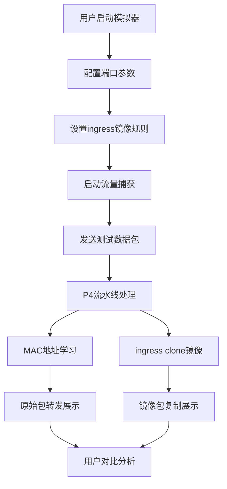

## 1. 产品概述
P4模拟器是一款基于Python + Scapy实现的网络数据包处理仿真平台，模拟P4可编程交换机的转发流水线。主要用于网络技术学习、P4协议调试和流量可视化分析。

- 核心功能：MAC地址学习转发、ingress端口镜像、流量可视化
- 目标用户：网络工程师、P4开发者、网络安全研究人员
- 产品价值：无需物理交换机即可学习和验证P4转发逻辑

## 2. 核心功能

### 2.1 用户角色
| 角色 | 注册方式 | 核心权限 |
|------|---------|---------|
| 普通用户 | 无（本地应用） | 完整使用所有功能，配置交换机参数，查看数据包 |

### 2.2 功能模块
1. **交换机控制页面**：端口配置、MAC学习状态、镜像规则管理
2. **流量监控面板**：原始包实时展示、镜像包实时展示、数据包详情解析
3. **系统控制台**：运行日志、统计信息、模拟器控制

### 2.3 页面详情
| 页面名称 | 模块名称 | 功能描述 |
|---------|---------|---------|
| 主控面板 | 交换机状态 | 显示各端口状态、MAC地址表、转发统计 |
| 主控面板 | 镜像配置 | 配置ingress clone规则，选择监控端口 |
| 流量监控 | 原始包列表 | 实时展示原始数据包，支持按协议/端口过滤 |
| 流量监控 | 镜像包列表 | 实时展示镜像数据包，标记复制来源 |
| 流量监控 | 数据包详情 | 解析展示以太网帧、IP、TCP/UDP等各层头部 |
| 系统控制 | 模拟器控制 | 启动/停止模拟器、清空MAC表、导出数据 |

## 3. 核心流程

用户启动P4模拟器 → 配置端口和镜像规则 → 发送测试流量 → 观察MAC学习过程 → 对比原始包和镜像包 → 分析转发逻辑

## 4. 用户界面设计

### 4.1 设计风格
- **主色调**：深色科技风，深蓝色(#0a192f)为背景，青色(#64ffda)为强调色
- **辅助色**：橙色(#ff9f43)标记镜像包，绿色(#26de81)标记正常转发
- **字体**：JetBrains Mono等宽字体展示数据包，Inter作为界面字体
- **布局**：左右分栏，左侧交换机控制，右侧流量监控
- **视觉效果**：赛博朋克风格，网格背景，荧光边框，滚动数字动画

### 4.2 页面设计概述
| 页面名称 | 模块名称 | UI元素 |
|---------|---------|--------|
| 主控面板 | 交换机状态 | 端口卡片网格，实时状态指示灯，MAC表滚动列表 |
| 主控面板 | 镜像配置 | 开关式规则配置，端口选择下拉，规则列表卡片 |
| 流量监控 | 包列表 | 时间序列卡片布局，协议颜色标记，hover详情预览 |
| 流量监控 | 包详情 | 树形结构展开，十六进制和ASCII对照展示 |
| 系统控制 | 控制台 | 滚动日志输出，统计数字跳动动画 |

### 4.3 响应性
- 桌面端优先设计，左右双栏布局
- 平板端自适应为上下布局
- 移动端简化为Tab切换模式
- 数据包表格支持横向滚动

### 4.4 动效设计
- 新数据包到达时从右侧滑入，带绿色高亮闪烁
- 镜像包标记橙色脉冲动画
- MAC表更新时行高亮过渡
- 端口状态变化时呼吸灯效果
- 数字统计滚动动画
