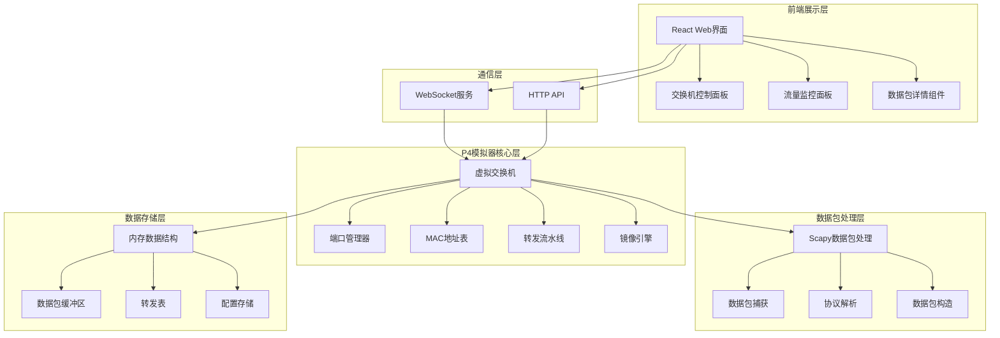
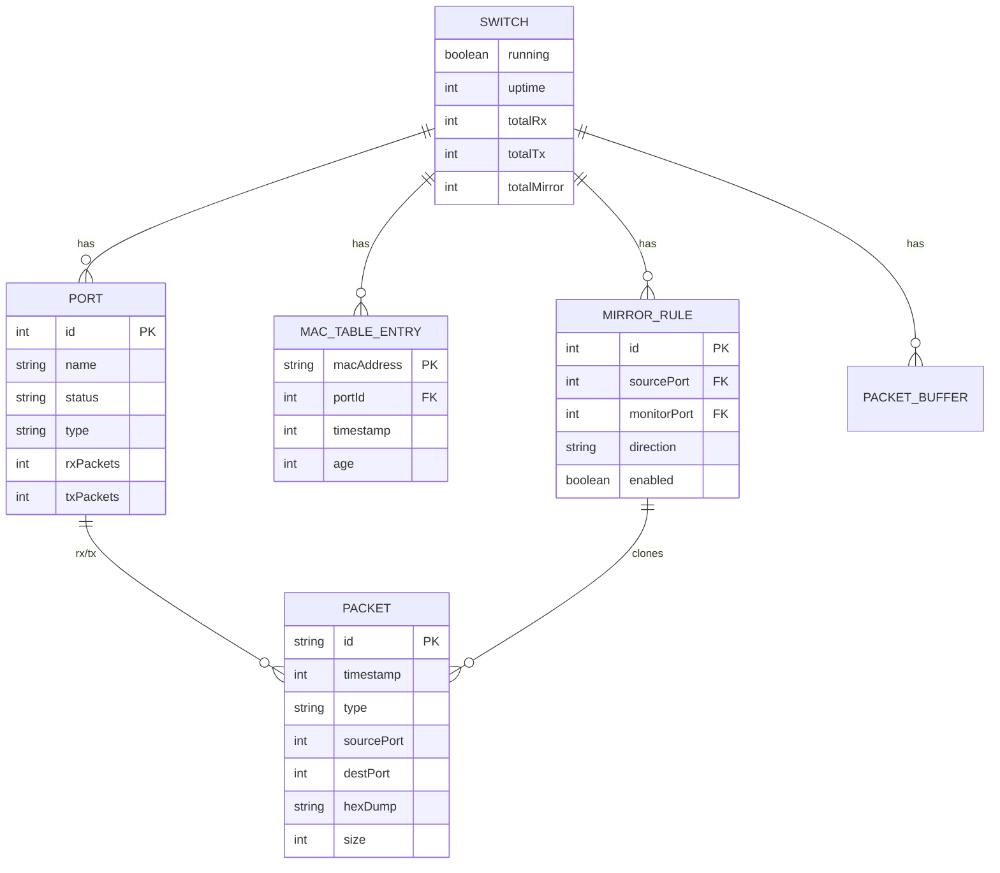
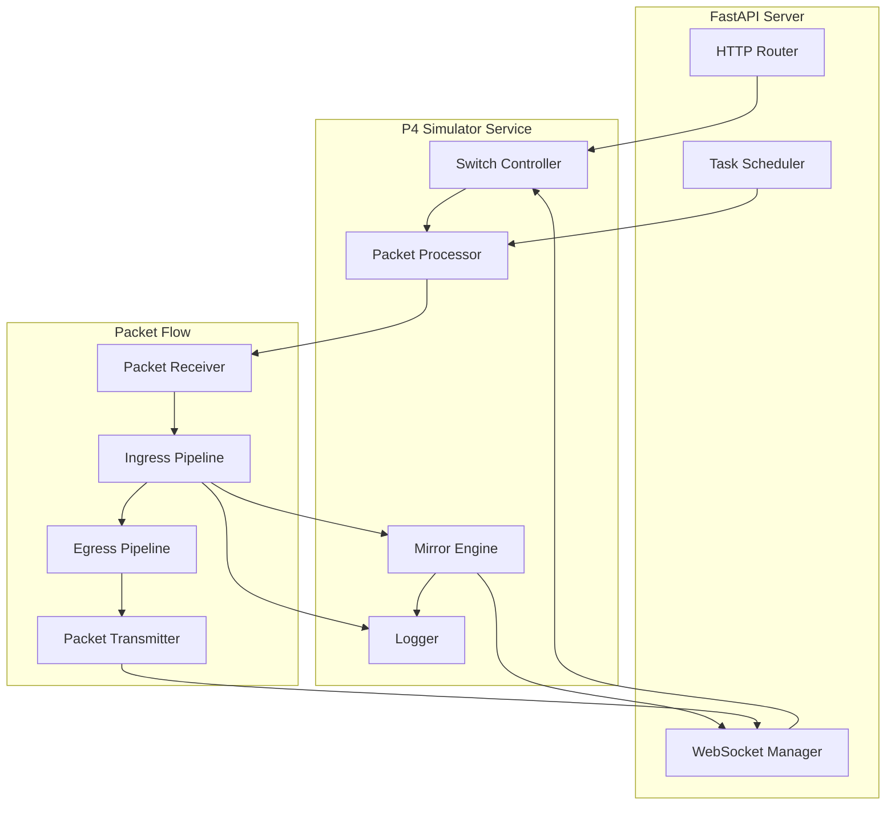

## 1. 架构设计



## 2. 技术描述

### 2.1 前端技术栈
- **框架**: React@18 + TypeScript
- **构建工具**: Vite@5
- **样式方案**: TailwindCSS@3 + CSS变量
- **状态管理**: React hooks + WebSocket实时推送
- **图表可视化**: 自定义Canvas组件绘制数据包时序
- **依赖库**: 
  - `lucide-react` - 图标库
  - `framer-motion` - 动画效果

### 2.2 后端技术栈
- **运行时**: Python@3.9+
- **网络框架**: FastAPI@0.104 + Uvicorn
- **WebSocket**: FastAPI WebSocket
- **数据包处理**: Scapy@2.5.0
- **异步处理**: asyncio

### 2.3 核心依赖
```
# Python依赖
fastapi==0.104.1
uvicorn==0.24.0
scapy==2.5.0
python-multipart==0.0.6

# Node依赖
react@18.2.0
react-dom@18.2.0
typescript@5.3.0
tailwindcss@3.3.5
vite@5.0.0
framer-motion@10.16.5
lucide-react@0.294.0
```

## 3. 目录结构

```
p375/
├── backend/
│   ├── main.py                 # FastAPI入口
│   ├── p4_simulator/           # P4模拟器核心
│   │   ├── __init__.py
│   │   ├── switch.py           # 虚拟交换机
│   │   ├── port.py             # 端口管理
│   │   ├── pipeline.py         # 转发流水线
│   │   ├── mac_table.py        # MAC地址表
│   │   ├── mirror.py           # 镜像引擎
│   │   └── packet_handler.py   # 数据包处理
│   ├── api/                    # API路由
│   │   ├── __init__.py
│   │   ├── switch.py           # 交换机控制API
│   │   └── websocket.py        # WebSocket处理
│   └── requirements.txt
├── frontend/
│   ├── src/
│   │   ├── components/         # React组件
│   │   │   ├── SwitchControl/  # 交换机控制
│   │   │   ├── TrafficMonitor/ # 流量监控
│   │   │   ├── PacketDetail/   # 数据包详情
│   │   │   └── Console/        # 控制台
│   │   ├── hooks/              # 自定义hooks
│   │   │   └── useWebSocket.ts # WebSocket hook
│   │   ├── types/              # TypeScript类型定义
│   │   ├── utils/              # 工具函数
│   │   ├── App.tsx
│   │   └── main.tsx
│   ├── package.json
│   ├── tailwind.config.js
│   └── vite.config.ts
└── scripts/
    ├── start.sh                # 启动脚本
    └── test_traffic.py         # 测试流量生成脚本
```

## 4. 路由定义

| 路由 | 方法 | 用途 |
|------|------|------|
| /api/switch/status | GET | 获取交换机状态 |
| /api/switch/ports | GET | 获取端口列表 |
| /api/switch/ports | POST | 配置端口 |
| /api/switch/mac-table | GET | 获取MAC地址表 |
| /api/switch/mac-table | DELETE | 清空MAC地址表 |
| /api/switch/mirror | GET | 获取镜像配置 |
| /api/switch/mirror | POST | 配置镜像规则 |
| /api/switch/mirror/{id} | DELETE | 删除镜像规则 |
| /api/switch/start | POST | 启动模拟器 |
| /api/switch/stop | POST | 停止模拟器 |
| /api/packets | GET | 获取历史数据包 |
| /api/packets/export | GET | 导出数据包 |
| /ws/packets | WS | 实时数据包推送 |
| /ws/logs | WS | 实时日志推送 |

## 5. API类型定义

```typescript
// 端口配置
interface Port {
  id: number;
  name: string;
  status: 'up' | 'down';
  type: 'normal' | 'monitor';
  macAddress?: string;
  rxPackets: number;
  txPackets: number;
}

// MAC地址表项
interface MacTableEntry {
  macAddress: string;
  portId: number;
  timestamp: number;
  age: number;
}

// 镜像规则
interface MirrorRule {
  id: number;
  sourcePort: number;
  monitorPort: number;
  direction: 'ingress' | 'egress' | 'both';
  enabled: boolean;
}

// 数据包信息
interface PacketInfo {
  id: string;
  timestamp: number;
  type: 'original' | 'mirror';
  sourcePort: number;
  destPort?: number;
  mirrorSourcePort?: number;
  ethernet: {
    srcMac: string;
    dstMac: string;
    etherType: number;
  };
  ip?: {
    version: number;
    srcIp: string;
    dstIp: string;
    protocol: number;
    ttl: number;
  };
  transport?: {
    protocol: 'tcp' | 'udp' | 'icmp';
    srcPort?: number;
    dstPort?: number;
    flags?: string[];
  };
  payload: string;
  hexDump: string;
  size: number;
}

// 交换机状态
interface SwitchStatus {
  running: boolean;
  uptime: number;
  totalRxPackets: number;
  totalTxPackets: number;
  totalMirrorPackets: number;
  macTableSize: number;
}

// WebSocket消息
interface WebSocketMessage {
  type: 'packet' | 'log' | 'status' | 'mac_update' | 'port_update';
  data: PacketInfo | LogEntry | SwitchStatus | MacTableEntry | Port;
}
```

## 6. 数据模型

### 6.1 核心数据结构



### 6.2 核心算法 - MAC学习转发流水线

```python
# P4转发流水线伪代码
def ingress_pipeline(packet, in_port):
    # 1. 解析包头
    eth = parse_ethernet(packet)
    
    # 2. MAC学习 (Ingress)
    mac_table.learn(eth.src_mac, in_port)
    
    # 3. Ingress镜像 (Clone)
    if mirror_rule.exists(in_port, 'ingress'):
        clone_packet = packet.copy()
        clone_to_monitor_port(clone_packet)
    
    # 4. 转发决策
    out_port = mac_table.lookup(eth.dst_mac)
    if out_port is None:
        out_port = FLOOD  # 广播到所有端口除入口
    
    # 5. Egress处理
    egress_pipeline(packet, out_port)
    
    return out_port
```

## 7. 服务器架构


