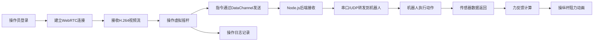

## 1. 产品概述

WebRTC机器人远程控制系统，通过Web前端实现对机器人的实时操控。系统支持低延迟H.264视频流传输、虚拟操纵杆控制、力反馈虚拟墙功能，并记录所有操作日志。

- **主要用途**：远程控制机器人进行巡检、操作或探索任务
- **目标用户**：机器人操作员、技术人员、远程监控人员
- **产品价值**：实现低延迟高清视频传输 + 直观的操纵杆控制 + 智能力反馈 + 完整操作审计

## 2. 核心功能

### 2.1 用户角色
| 角色 | 登录方式 | 核心权限 |
|------|----------|----------|
| 操作员 | 用户名密码登录 | 机器人控制、视频查看、力反馈体验 |
| 管理员 | 管理员账号 | 查看操作日志、用户管理、系统配置 |

### 2.2 功能模块
1. **控制主页**：视频显示区、虚拟操纵杆、力反馈指示器、连接状态
2. **日志页面**：操作日志列表、搜索过滤、日志详情
3. **系统设置**：连接配置、视频参数、控制灵敏度调整

### 2.3 页面详情
| 页面名称 | 模块名称 | 功能描述 |
|-----------|-------------|---------------------|
| 控制主页 | 视频显示区 | WebRTC接收H.264视频流，低延迟实时渲染 |
| 控制主页 | 虚拟操纵杆 | 双摇杆（方向+速度），鼠标/触摸控制 |
| 控制主页 | 力反馈 | 虚拟墙检测，操纵杆阻力反馈动画 |
| 控制主页 | 状态面板 | 连接状态、延迟、传感器数据显示 |
| 日志页面 | 日志列表 | 分页显示操作记录，支持时间/用户筛选 |
| 系统设置 | 参数配置 | WebRTC配置、串口/UDP设置、视频参数 |

## 3. 核心流程

### 3.1 控制流程
操作员登录系统 → 建立WebRTC连接 → 接收视频流 → 操作虚拟摇杆 → 指令通过数据通道发送 → 后端转发到机器人 → 传感器数据返回 → 力反馈生效 → 操作日志记录

### 3.2 日志记录流程
操作指令生成 → 指令发送到后端 → 后端写入数据库 → 日志页面查询展示

## 4. 用户界面设计

### 4.1 设计风格
- **主色调**：深科技蓝 (#0A1628)，科技感暗色主题
- **强调色**：霓虹青 (#00D4FF)，用于按钮、状态指示
- **警示色**：警戒红 (#FF4757)，用于虚拟墙警告
- **按钮风格**：圆角矩形，发光边框，悬停动效
- **字体**：JetBrains Mono 等宽字体 + Inter 无衬线字体
- **布局风格**：网格化仪表盘，左侧视频主区域，右侧控制面板
- **视觉效果**：扫描线效果、发光边框、科技感渐变

### 4.2 页面设计概述
| 页面名称 | 模块名称 | UI元素 |
|-----------|-------------|-------------|
| 控制主页 | 视频显示区 | 全屏视频，扫描线覆盖，延迟数字叠加 |
| 控制主页 | 虚拟操纵杆 | 圆形摇杆底座，发光指示球，力反馈震动动画 |
| 控制主页 | 状态面板 | HUD风格数据展示，实时更新传感器数值 |
| 控制主页 | 力反馈指示器 | 环形进度条，颜色从绿到红渐变显示阻力 |
| 日志页面 | 日志列表 | 表格布局，时间轴样式，搜索过滤栏 |
| 系统设置 | 参数配置 | 分组卡片，滑块调节，开关切换 |

### 4.3 响应式
- **桌面端**：左右分栏布局，左侧70%视频区，右侧30%控制面板
- **平板端**：上下布局，视频在上，控制在下
- **移动端**：垂直堆叠，触摸优化的操纵杆尺寸

### 4.4 交互细节
- 操纵杆拖拽：跟随鼠标/触摸，释放回弹
- 力反馈：接近虚拟墙时摇杆抖动、背景色变红、阻力增加动画
- 视频加载：骨架屏 + 脉冲动画
- 状态切换：连接/断开的过渡动画
