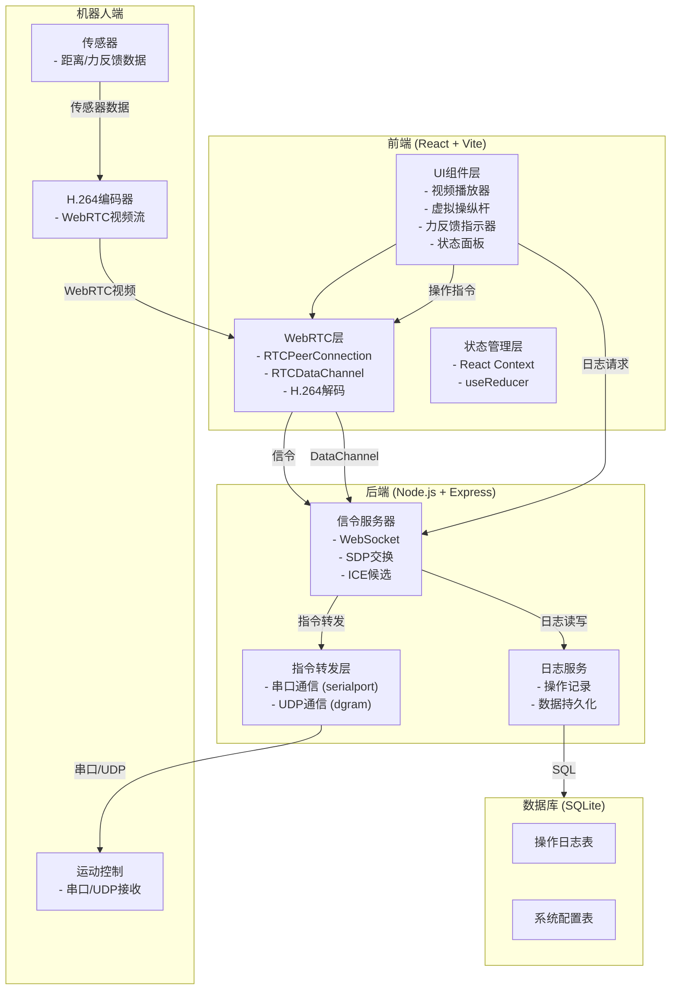
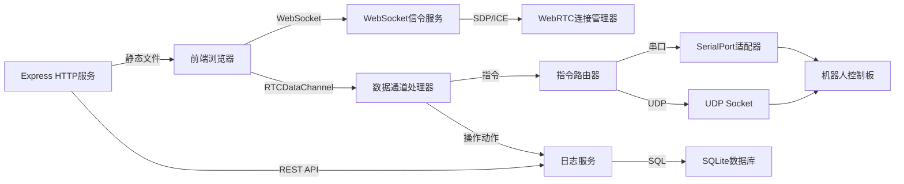
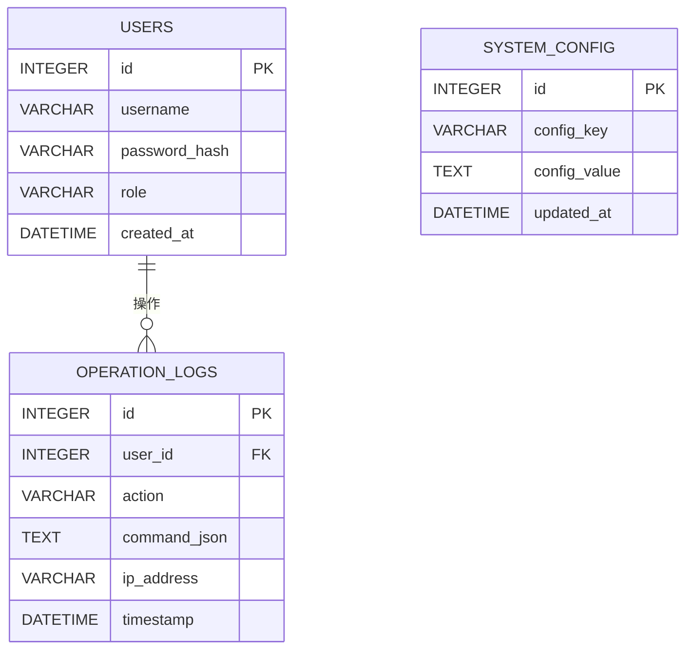

## 1. 架构设计



## 2. 技术描述

### 2.1 技术栈选择
- **前端框架**：React@18 + TypeScript + Vite@5
- **样式方案**：TailwindCSS@3 + CSS Modules
- **WebRTC库**：simple-peer (封装原生WebRTC API)
- **H.264解码**：WebCodecs API (原生浏览器支持)
- **状态管理**：React Context + useReducer
- **后端框架**：Node.js + Express@4 + TypeScript
- **WebSocket**：ws库
- **串口通信**：serialport
- **数据库**：SQLite + better-sqlite3
- **实时通信**：RTCDataChannel (低延迟指令传输)

### 2.2 核心技术方案

#### WebRTC视频流
- 使用RTCPeerConnection建立点对点连接
- 视频编码：H.264 High Profile，低延迟模式
- 视频容器：RTP包直接传输，无需封装
- 解码：浏览器WebCodecs API硬件加速
- 目标延迟：< 100ms

#### 指令传输
- 使用RTCDataChannel (ordered: false, maxRetransmits: 0)
- 指令格式：JSON对象，包含x/y坐标、速度、时间戳
- 频率：最高60Hz，根据网络自适应

#### 力反馈实现
- 虚拟墙算法：基于距离传感器数据
- 阻力计算公式：force = k * (1 / distance - threshold)
- UI反馈：摇杆抖动、颜色变化、阻力动画

## 3. 路由定义

### 前端路由
| 路由 | 页面 | 功能 |
|-------|------|------|
| / | 控制主页 | 视频显示、操纵杆控制、力反馈 |
| /logs | 日志页面 | 操作日志查询和展示 |
| /settings | 设置页面 | 系统参数配置 |
| /login | 登录页面 | 用户认证 |

### 后端API路由
| 路由 | 方法 | 功能 |
|-------|------|------|
| /api/health | GET | 健康检查 |
| /api/logs | GET | 查询操作日志 |
| /api/logs | POST | 记录操作日志 |
| /api/config | GET | 获取系统配置 |
| /api/config | PUT | 更新系统配置 |
| /api/serial/ports | GET | 获取可用串口列表 |
| /ws | WebSocket | WebRTC信令交换 |

## 4. API定义

### 4.1 指令数据格式 (RTCDataChannel)
```typescript
interface ControlCommand {
  type: 'move' | 'stop' | 'custom';
  joystickId: 'left' | 'right';
  x: number;           // -1 到 1
  y: number;           // -1 到 1
  speed: number;       // 0 到 1
  timestamp: number;
}

interface SensorData {
  type: 'distance' | 'force' | 'status';
  distance?: number;   // 厘米
  angle?: number;      // 方向角度
  battery?: number;    // 电量百分比
  timestamp: number;
}

interface ForceFeedback {
  resistance: number;  // 0 到 1
  direction: { x: number; y: number };
  warning: 'none' | 'caution' | 'danger';
}
```

### 4.2 日志API
```typescript
// GET /api/logs?page=1&limit=20
interface LogQuery {
  page?: number;
  limit?: number;
  userId?: string;
  startDate?: string;
  endDate?: string;
}

interface LogEntry {
  id: number;
  userId: string;
  action: string;
  command: object;
  timestamp: string;
  ip: string;
}

interface LogResponse {
  data: LogEntry[];
  total: number;
  page: number;
  limit: number;
}
```

## 5. 服务器架构



### 5.1 核心模块职责
- **WebSocket信令服务**：处理SDP offer/answer交换，ICE候选转发
- **WebRTC连接管理器**：维护Peer连接状态，处理重连
- **指令路由器**：根据配置选择串口或UDP转发
- **日志服务**：异步写入操作日志，提供查询接口

## 6. 数据模型

### 6.1 ER图



### 6.2 DDL语句

```sql
-- 用户表
CREATE TABLE users (
  id INTEGER PRIMARY KEY AUTOINCREMENT,
  username VARCHAR(50) UNIQUE NOT NULL,
  password_hash VARCHAR(255) NOT NULL,
  role VARCHAR(20) DEFAULT 'operator',
  created_at DATETIME DEFAULT CURRENT_TIMESTAMP
);

-- 操作日志表
CREATE TABLE operation_logs (
  id INTEGER PRIMARY KEY AUTOINCREMENT,
  user_id INTEGER REFERENCES users(id),
  action VARCHAR(100) NOT NULL,
  command_json TEXT,
  ip_address VARCHAR(45),
  timestamp DATETIME DEFAULT CURRENT_TIMESTAMP
);

-- 系统配置表
CREATE TABLE system_config (
  id INTEGER PRIMARY KEY AUTOINCREMENT,
  config_key VARCHAR(100) UNIQUE NOT NULL,
  config_value TEXT,
  updated_at DATETIME DEFAULT CURRENT_TIMESTAMP
);

-- 索引
CREATE INDEX idx_logs_timestamp ON operation_logs(timestamp);
CREATE INDEX idx_logs_user_id ON operation_logs(user_id);

-- 默认管理员账号 (密码: admin123)
INSERT INTO users (username, password_hash, role) VALUES 
('admin', '$2b$10$...hashed_password...', 'admin');
```

## 7. 项目结构

```
p40/
├── client/                 # 前端项目
│   ├── src/
│   │   ├── components/
│   │   │   ├── VideoPlayer.tsx
│   │   │   ├── Joystick.tsx
│   │   │   ├── ForceFeedback.tsx
│   │   │   └── StatusPanel.tsx
│   │   ├── hooks/
│   │   │   ├── useWebRTC.ts
│   │   │   └── useJoystick.ts
│   │   ├── context/
│   │   │   └── AppContext.tsx
│   │   ├── pages/
│   │   ├── utils/
│   │   └── App.tsx
│   ├── package.json
│   └── vite.config.ts
├── server/                 # 后端项目
│   ├── src/
│   │   ├── server.ts
│   │   ├── webrtc/
│   │   │   ├── SignalingServer.ts
│   │   │   └── PeerManager.ts
│   │   ├── controllers/
│   │   │   ├── LogController.ts
│   │   │   └── ConfigController.ts
│   │   ├── services/
│   │   │   ├── SerialService.ts
│   │   │   ├── UDPService.ts
│   │   │   └── DatabaseService.ts
│   │   └── types/
│   ├── package.json
│   └── tsconfig.json
└── README.md
```
