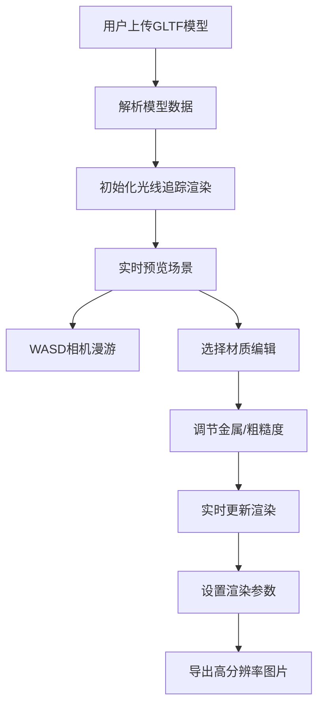

## 1. 产品概述

基于Web的3D光线追踪场景编辑器，支持GLTF模型加载、实时材质编辑、自由相机漫游和高分辨率渲染导出。

- 面向3D艺术家、设计师和开发者，提供轻量级的Web端3D场景预览和材质编辑工具。

## 2. 核心功能

### 2.1 用户角色

| 角色 | 注册方式 | 核心权限 |
|------|----------|----------|
| 普通用户 | 无需注册 | 加载场景、编辑材质、导出图片 |

### 2.2 功能模块

1. **3D视图页**：场景渲染视口、相机控制、渲染模式切换
2. **材质编辑器**：金属度/粗糙度调节、材质选择面板
3. **场景管理**：GLTF模型加载、场景保存/加载
4. **渲染导出**：高分辨率图片导出设置

### 2.3 页面详情

| 页面名称 | 模块名称 | 功能描述 |
|-----------|-------------|---------------------|
| 3D编辑器 | 场景视口 | WASM加速路径追踪渲染，实时预览 |
| 3D编辑器 | 相机控制 | WASD移动、鼠标视角、滚轮缩放 |
| 材质面板 | 材质列表 | 显示场景中所有可编辑材质 |
| 材质面板 | 属性调节 | 金属度、粗糙度滑块实时调节 |
| 场景管理 | 文件上传 | 本地GLTF/GLB文件上传加载 |
| 场景管理 | 云端存储 | 保存场景到后端、从后端加载场景 |
| 渲染导出 | 参数设置 | 分辨率、采样数设置 |
| 渲染输出 | 图片下载 | 高分辨率PNG图片导出下载 |

## 3. 核心流程

用户上传GLTF模型 → 系统解析并渲染场景 → 用户通过WASD漫游场景 → 选择材质调节金属/粗糙度 → 调整渲染参数 → 导出高分辨率图片。

## 4. 用户界面设计

### 4.1 设计风格

- **主色调**：深空黑 (#0a0a0f) 搭配霓虹蓝 (#00f0ff)
- **辅助色**：金属橙 (#ff6b35) 用于交互元素
- **按钮风格**：半透明玻璃态，圆角8px，悬停发光效果
- **字体**：Orbitron（标题）+ JetBrains Mono（代码/数值）
- **布局风格**：深色科技风，三面栏布局
- **图标**：Lucide 线性图标

### 4.2 页面设计概述

| 页面名称 | 模块名称 | UI元素 |
|-----------|-------------|-------------|
| 3D编辑器 | 场景视口 | 全屏Canvas渲染、悬浮控制面板、FPS风格相机指示 |
| 材质面板 | 左侧边栏 | 可折叠面板、滑动条、数值输入框、实时预览小球 |
| 场景管理 | 顶部工具栏 | 文件上传按钮、保存/加载按钮、渲染模式切换 |
| 渲染导出 | 右侧边栏 | 分辨率选择器、采样数滑块、导出进度条 |

### 4.3 响应式

桌面端优先，侧边栏可折叠适配平板，移动端简化为单栏布局。

### 4.4 3D场景指导

- **环境/HDRI**：工业风室内HDR，柔和反光
- **光照设置**：路径追踪全局光照，软阴影，漫反射反弹
- **相机设置**：透视相机，FOV 60°，近裁剪0.1，远裁剪1000
- **交互动画**：材质变化时平滑过渡，相机移动带阻尼
- **后期处理**：ACES色调映射，轻微泛光，薄膜色调
