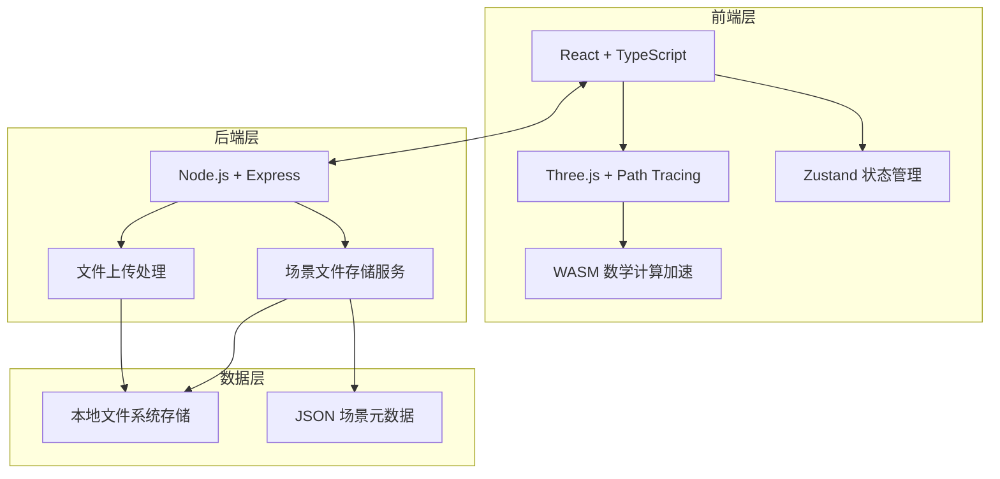
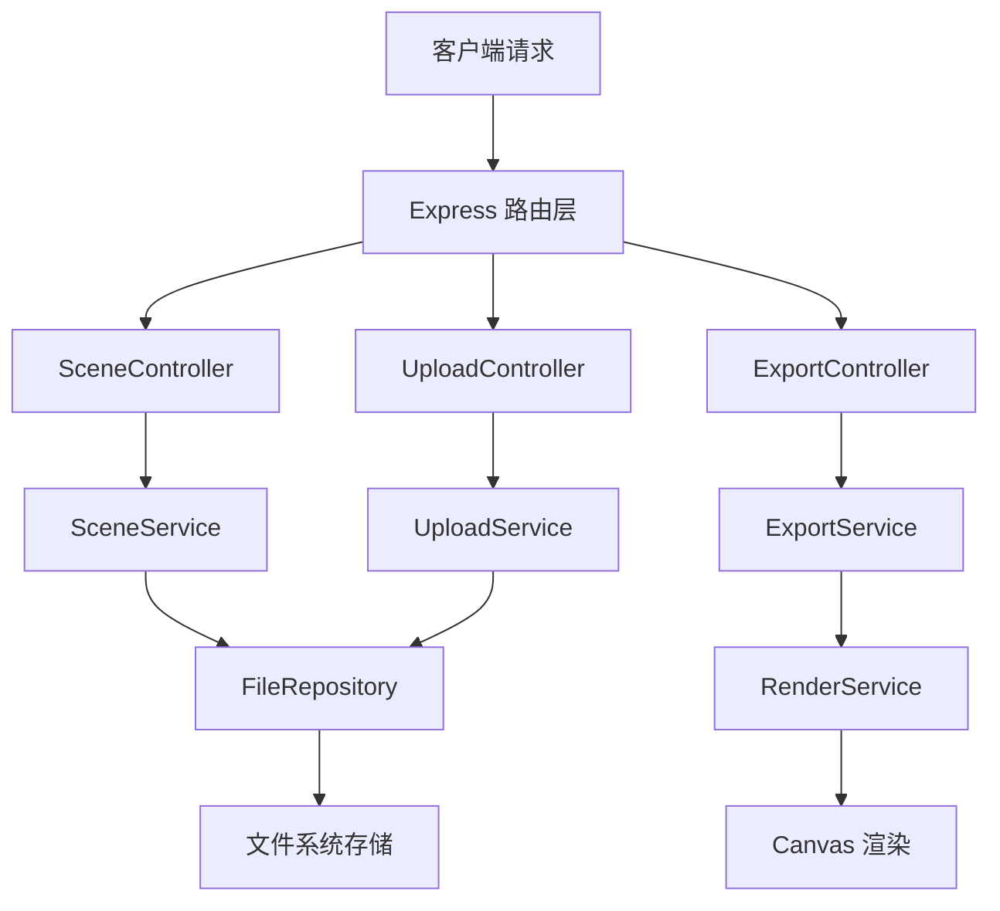
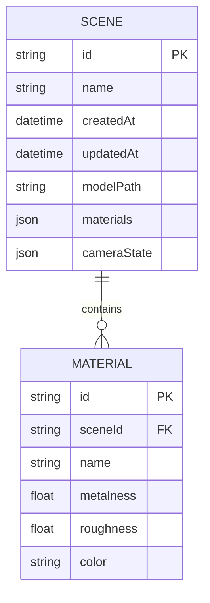

## 1. 架构设计



## 2. 技术描述

- **前端**：React@18 + TypeScript + Vite + TailwindCSS@3
- **3D引擎**：Three.js + three-path-tracing (基于WebGL2)
- **状态管理**：Zustand
- **图标**：lucide-react
- **后端**：Express@4 (Node.js)
- **文件存储**：本地文件系统 + multer
- **WASM模块**：用于加速光线追踪数学计算

## 3. 路由定义

| 路由 | 用途 |
|-------|---------|
| / | 主编辑器页面 |
| /api/scenes | 获取场景列表 |
| /api/scenes/:id | 获取/保存特定场景 |
| /api/upload | 上传GLTF模型文件 |
| /api/export | 导出高分辨率渲染图 |

## 4. API 定义

```typescript
// 场景元数据
interface SceneMetadata {
  id: string;
  name: string;
  createdAt: string;
  updatedAt: string;
  modelUrl: string;
  materials: MaterialConfig[];
  cameraPosition: [number, number, number];
  cameraTarget: [number, number, number];
}

// 材质配置
interface MaterialConfig {
  id: string;
  name: string;
  metalness: number;
  roughness: number;
  color: string;
}

// 渲染导出参数
interface ExportParams {
  width: number;
  height: number;
  samples: number;
  format: 'png' | 'jpg';
}

// API 响应
interface ApiResponse<T> {
  success: boolean;
  data?: T;
  error?: string;
}
```

## 5. 服务器架构图



## 6. 数据模型

### 6.1 数据模型定义



### 6.2 文件存储结构

```
storage/
├── scenes/
│   ├── {scene-id}.json
│   └── models/
│       └── {scene-id}/
│           ├── scene.gltf
│           └── textures/
└── exports/
    └── {export-id}.png
```
