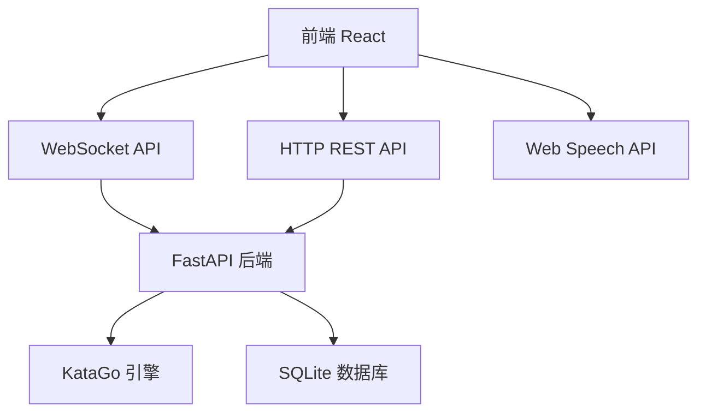
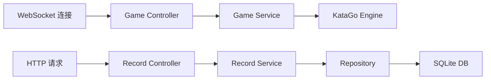
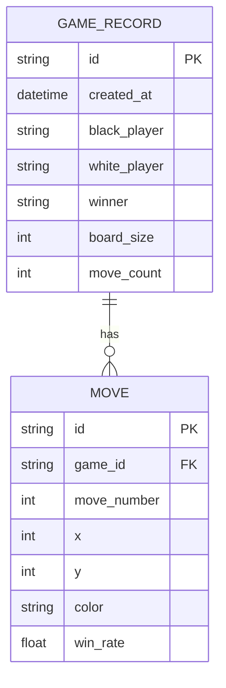

## 1. 架构设计



## 2. 技术描述

- **前端**：React@18 + TypeScript + Vite + TailwindCSS@3 + Zustand + Recharts
- **后端**：Python + FastAPI + WebSocket
- **AI引擎**：KataGo（简化版，使用预训练网络）
- **数据库**：SQLite（本地文件存储）
- **语音合成**：浏览器 Web Speech API

## 3. 路由定义

| 路由 | 目的 |
|------|------|
| / | 对弈大厅首页 |
| /game | 棋盘对弈页面 |
| /records | 棋谱记录页面 |
| /analysis/:id | 棋谱分析页面 |

## 4. API 定义

### 4.1 WebSocket 消息类型

```typescript
// 落子请求
interface MoveRequest {
  type: 'move';
  x: number;
  y: number;
  color: 'black' | 'white';
}

// AI 分析结果
interface AnalysisResponse {
  type: 'analysis';
  winRate: number; // 黑棋胜率 0-100
  scoreLead: number;
  topMoves: Array<{
    x: number;
    y: number;
    winRate: number;
    visits: number;
  }>;
}

// 游戏状态
interface GameState {
  type: 'game_state';
  board: string[][]; // 19x19, 'black'|'white'|null
  currentPlayer: 'black' | 'white';
  moveHistory: Move[];
  captures: { black: number; white: number };
}
```

### 4.2 REST API

```typescript
// 获取棋谱列表
GET /api/records
Response: {
  records: Array<{
    id: string;
    date: string;
    blackPlayer: string;
    whitePlayer: string;
    winner: 'black' | 'white';
    moves: number;
  }>;
}

// 保存棋谱
POST /api/records
Request: {
  blackPlayer: string;
  whitePlayer: string;
  boardSize: number;
  moves: Move[];
  winner: 'black' | 'white';
}

// 获取单条棋谱
GET /api/records/:id
Response: {
  id: string;
  date: string;
  boardSize: number;
  moves: Move[];
  winner: 'black' | 'white';
}

// 获取热点图数据
GET /api/records/:id/heatmap
Response: {
  heatmap: number[][]; // 19x19 热度值
}
```

## 5. 服务器架构



## 6. 数据模型

### 6.1 ER 图



### 6.2 DDL 语句

```sql
CREATE TABLE game_records (
  id TEXT PRIMARY KEY,
  created_at DATETIME DEFAULT CURRENT_TIMESTAMP,
  black_player TEXT NOT NULL,
  white_player TEXT NOT NULL,
  winner TEXT NOT NULL,
  board_size INTEGER NOT NULL DEFAULT 19,
  move_count INTEGER NOT NULL DEFAULT 0
);

CREATE TABLE moves (
  id TEXT PRIMARY KEY,
  game_id TEXT NOT NULL,
  move_number INTEGER NOT NULL,
  x INTEGER NOT NULL,
  y INTEGER NOT NULL,
  color TEXT NOT NULL,
  win_rate REAL,
  FOREIGN KEY (game_id) REFERENCES game_records(id)
);

CREATE INDEX idx_moves_game_id ON moves(game_id);
```
