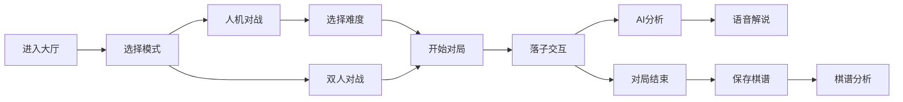

## 1. 产品概述

智能围棋对战平台，支持人机对战、双人对战，集成KataGo AI引擎提供智能分析和推荐。
- 主要目的：提供高质量的围棋对弈体验，支持AI辅助学习和棋谱分析
- 目标用户：围棋爱好者、初学者、进阶棋手
- 核心价值：结合AI引擎的智能对弈平台，提供实时解说和分析功能

## 2. 核心功能

### 2.1 用户角色

| 角色 | 注册方式 | 核心权限 |
|------|---------|---------|
| 普通用户 | 无需注册 | 对局、AI对战、查看棋谱 |

### 2.2 功能模块

1. **对弈大厅**：选择对战模式、难度设置、开始对局
2. **棋盘页面**：Canvas棋盘、落子交互、游戏状态显示
3. **AI分析面板**：胜率曲线、推荐点、热点图
4. **棋谱记录**：历史棋谱列表、棋谱回放、分析

### 2.3 页面详情

| 页面名称 | 模块名称 | 功能描述 |
|---------|---------|---------|
| 对弈大厅 | 模式选择 | 双人对战/人机对战切换，AI难度选择（初级/中级/高级） |
| 对弈大厅 | 快速开始 | 一键开始新对局，选择棋盘大小（9路/13路/19路） |
| 棋盘页面 | Canvas棋盘 | 19×19标准棋盘，实时落子动画，提子效果 |
| 棋盘页面 | 游戏控制 | 悔棋、认输、暂停、重新开始 |
| 棋盘页面 | 语音解说 | 实时播报胜率变化、推荐落子点 |
| AI分析面板 | 胜率显示 | 实时胜率曲线图表，当前局势评估 |
| AI分析面板 | 推荐点 | 显示AI推荐的前3个落子位置 |
| 棋谱页面 | 棋谱列表 | 历史对局记录，按时间排序 |
| 棋谱页面 | 热点图 | 显示对局中双方的落子热点分布 |

## 3. 核心流程

用户进入对弈大厅，选择对战模式和棋盘大小，开始对局。在对弈过程中，AI实时分析局势并提供推荐。对局结束后自动保存棋谱，用户可查看历史棋谱和进行热点图分析。

## 4. 用户界面设计

### 4.1 设计风格
- **主色调**：深木纹色 (#5D4037)，代表传统围棋的木质棋盘
- **辅助色**：金色 (#FFD700) 用于重点提示，石青色 (#607D8B) 用于界面元素
- **按钮风格**：圆角矩形，悬浮时轻微上浮效果
- **字体**：标题使用 Noto Serif SC，正文使用 Noto Sans SC
- **布局风格**：左侧棋盘主区域，右侧控制面板，传统与现代结合
- **图标风格**：线性图标，简洁优雅

### 4.2 页面设计概述

| 页面名称 | 模块名称 | UI 元素 |
|---------|---------|---------|
| 对弈大厅 | 模式卡片 | 木纹质感卡片，悬停放大动画，金色边框高亮 |
| 棋盘页面 | Canvas棋盘 | 真实木纹背景，立体棋子阴影，落子涟漪动画 |
| 棋盘页面 | 控制面板 | 半透明毛玻璃效果，滑动展开/收起动画 |
| AI分析面板 | 胜率图表 | 渐变曲线，实时更新动画 |
| 棋谱页面 | 热点图 | 热力渐变叠加，鼠标悬浮显示详细信息 |

### 4.3 响应式
- 桌面端：左右分栏布局，棋盘占2/3宽度
- 平板端：上下布局，控制面板折叠为可展开面板
- 移动端：垂直布局，优化触控落子区域

### 4.4 交互动效
- 落子时棋子从上方落下的弹性动画
- 提子时棋子消失的粒子效果
- 胜率变化时的平滑过渡动画
- 推荐点的呼吸闪烁效果
