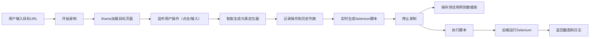

## 1. 产品概述

Selenium录制器是一款自动化测试工具，允许用户在浏览器中录制操作（点击、输入），自动生成可执行的Selenium测试脚本，并在后端执行脚本返回截图和执行日志。

- **核心价值**：降低自动化测试门槛，让非技术人员也能创建测试用例
- **目标用户**：QA测试工程师、开发人员、自动化测试从业者

## 2. 核心功能

### 2.1 用户角色
| 角色 | 注册方式 | 核心权限 |
|------|----------|----------|
| 普通用户 | 无需注册（本地使用） | 创建、编辑、执行测试用例 |

### 2.2 功能模块
1. **录制器面板**：操作录制控制、元素选择器配置
2. **脚本预览**：实时生成Python/JS Selenium代码
3. **测试用例管理**：测试用例列表、编辑、删除、搜索
4. **执行控制台**：脚本执行、截图展示、日志输出
5. **定位策略配置**：CSS/XPath选择器优先级设置

### 2.3 页面详情
| 页面名称 | 模块名称 | 功能描述 |
|----------|----------|----------|
| 主页面 | 录制控制面板 | 开始/停止录制、清空操作、选择目标网站 |
| 主页面 | 操作历史列表 | 显示已录制的操作步骤，支持删除单条 |
| 主页面 | 脚本生成器 | 选择脚本语言（Python/JS）、复制代码、下载脚本 |
| 主页面 | 执行控制台 | 运行脚本、展示截图、查看执行日志 |
| 主页面 | 测试用例管理 | 保存测试用例、加载历史用例、删除用例 |
| 主页面 | 定位策略配置 | 配置元素定位优先级（ID > CSS > XPath等） |

## 3. 核心流程

## 4. 界面设计

### 4.1 设计风格
- **主色调**：深蓝色 (#165DFF) - 体现专业、科技感
- **辅助色**：青绿色 (#00B42A) 表示成功，橙红色 (#FF7D00) 表示警告
- **按钮风格**：圆角8px，带轻微阴影，hover时有缩放效果
- **字体**：主字体使用 JetBrains Mono（代码区）、Inter（界面）
- **布局风格**：三栏式布局（左侧操作列表、中间iframe预览、右侧脚本/控制台）
- **图标风格**：使用线性图标，简洁专业

### 4.2 页面设计概览
| 页面名称 | 模块名称 | UI元素 |
|----------|----------|--------|
| 主页面 | 顶部导航栏 | Logo、录制状态指示器、设置按钮 |
| 主页面 | 左侧操作面板 | URL输入框、录制按钮、操作历史列表 |
| 主页面 | 中间预览区 | iframe容器、元素高亮遮罩 |
| 主页面 | 右侧面板 | Tab切换（脚本/执行/用例）、代码编辑器、控制台 |
| 主页面 | 定位策略弹窗 | 选择器优先级拖拽排序、预览当前定位器 |

### 4.3 响应式设计
- **桌面端**：三栏布局，左右固定宽度，中间自适应
- **平板端**：两栏布局，右侧面板可折叠
- **移动端**：单栏布局，通过Tab切换各功能区

### 4.4 交互细节
- 录制开始时按钮变红并脉冲动画
- 鼠标悬停在iframe元素上时高亮显示并显示定位器信息
- 代码区支持语法高亮和行号显示
- 执行时显示进度条和实时日志流
