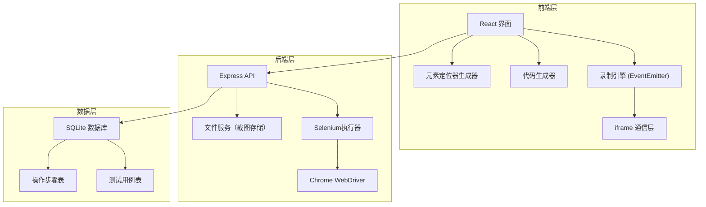
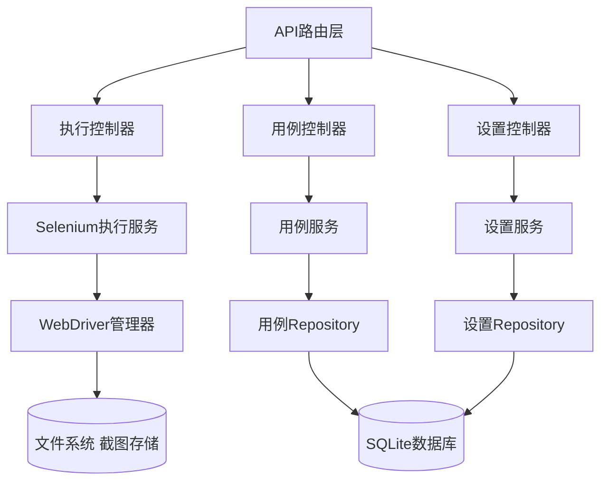
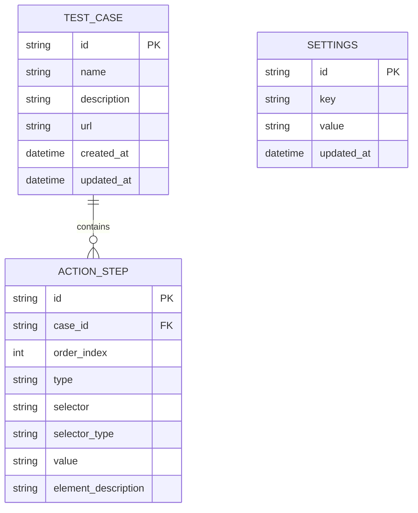

## 1. 架构设计



## 2. 技术选型

- **前端**：React@18 + TypeScript + TailwindCSS@3 + Vite + Monaco Editor
- **后端**：Express@4 + Node.js
- **浏览器自动化**：Selenium WebDriver + ChromeDriver
- **数据库**：SQLite3 (本地存储)
- **代码高亮**：@monaco-editor/react
- **HTTP客户端**：Axios

## 3. 路由定义

| 路由 | 用途 |
|------|------|
| / | 主页面（录制器+执行控制台） |
| /cases | 测试用例管理页面 |
| /settings | 设置页面（定位策略配置） |

## 4. API 定义

### 4.1 TypeScript 类型定义

```typescript
// 操作步骤类型
interface ActionStep {
  id: string;
  type: 'click' | 'input' | 'navigate' | 'wait';
  selector: string;
  selectorType: 'css' | 'xpath' | 'id';
  value?: string;
  timestamp: number;
  elementDescription?: string;
}

// 测试用例类型
interface TestCase {
  id: string;
  name: string;
  description: string;
  url: string;
  steps: ActionStep[];
  createdAt: string;
  updatedAt: string;
}

// 执行结果类型
interface ExecutionResult {
  success: boolean;
  screenshot?: string; // base64 or URL
  logs: string[];
  duration: number;
  error?: string;
}
```

### 4.2 API 接口

| 方法 | 路径 | 描述 | 请求体 | 响应 |
|------|------|------|--------|------|
| POST | /api/execute | 执行Selenium脚本 | { script: string, language: 'python' \| 'javascript' } | ExecutionResult |
| GET | /api/cases | 获取所有测试用例 | - | TestCase[] |
| POST | /api/cases | 保存测试用例 | TestCase | TestCase |
| PUT | /api/cases/:id | 更新测试用例 | TestCase | TestCase |
| DELETE | /api/cases/:id | 删除测试用例 | - | { success: boolean } |
| GET | /api/settings | 获取定位策略配置 | - | SelectorStrategy |
| POST | /api/settings | 保存定位策略配置 | SelectorStrategy | SelectorStrategy |

## 5. 服务端架构



## 6. 数据模型

### 6.1 ER 图



### 6.2 DDL 语句

```sql
-- 测试用例表
CREATE TABLE IF NOT EXISTS test_cases (
  id TEXT PRIMARY KEY,
  name TEXT NOT NULL,
  description TEXT,
  url TEXT NOT NULL,
  created_at DATETIME DEFAULT CURRENT_TIMESTAMP,
  updated_at DATETIME DEFAULT CURRENT_TIMESTAMP
);

-- 操作步骤表
CREATE TABLE IF NOT EXISTS action_steps (
  id TEXT PRIMARY KEY,
  case_id TEXT NOT NULL,
  order_index INTEGER NOT NULL,
  type TEXT NOT NULL,
  selector TEXT NOT NULL,
  selector_type TEXT NOT NULL,
  value TEXT,
  element_description TEXT,
  FOREIGN KEY (case_id) REFERENCES test_cases(id) ON DELETE CASCADE
);

-- 设置表
CREATE TABLE IF NOT EXISTS settings (
  id TEXT PRIMARY KEY,
  key TEXT UNIQUE NOT NULL,
  value TEXT NOT NULL,
  updated_at DATETIME DEFAULT CURRENT_TIMESTAMP
);

-- 初始定位策略配置
INSERT OR IGNORE INTO settings (id, key, value) VALUES 
('1', 'selector_priority', '["id","name","css","xpath"]');
```
