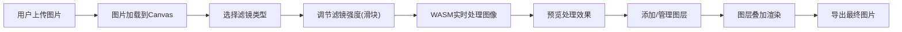

## 1. 产品概述

基于WebAssembly的高性能图像滤镜处理应用，支持用户上传图片并实时应用多种滤镜效果。
- 主要用途：提供快速、高质量的图像滤镜处理，支持模糊、锐化、边缘检测、油画等效果
- 目标用户：需要快速图像处理的设计师、摄影师、普通用户
- 产品价值：利用WASM技术实现高性能客户端图像处理，无需等待服务器响应

## 2. 核心功能

### 2.1 用户角色
| 角色 | 注册方式 | 核心权限 |
|------|----------|----------|
| 普通用户 | 无需注册 | 上传图片、应用滤镜、调节参数、保存图片 |

### 2.2 功能模块
1. **主页面**：图片上传区域、滤镜控制面板、实时预览区、图层面板
2. **滤镜系统**：模糊、锐化、边缘检测、油画四种滤镜，支持强度调节
3. **图层系统**：支持多图层叠加，可调节图层透明度和混合模式
4. **图片导出**：支持导出处理后的图片

### 2.3 页面详情
| 页面名称 | 模块名称 | 功能描述 |
|---------|----------|----------|
| 主页面 | 图片上传 | 拖拽或点击上传图片，支持常见图片格式 |
| 主页面 | 滤镜控制 | 四种滤镜切换，滑块实时调节强度，实时预览 |
| 主页面 | 图层管理 | 添加/删除图层，调节图层顺序、透明度、混合模式 |
| 主页面 | 导出功能 | 下载处理后的图片到本地 |

## 3. 核心流程

## 4. 用户界面设计

### 4.1 设计风格
- **主色调**：深色主题，深灰(#1a1a2e)背景，霓虹蓝(#00d4ff)作为强调色
- **按钮风格**：圆角矩形，带有微妙发光效果，悬停时有动画
- **字体**：展示字体使用 Space Grotesk，正文字体使用 JetBrains Mono
- **布局风格**：三栏布局，左侧图层面板，中间预览区，右侧滤镜控制面板
- **视觉风格**：赛博朋克/科技感，玻璃拟态效果，微妙的网格背景

### 4.2 页面设计概述
| 页面名称 | 模块名称 | UI 元素 |
|---------|----------|---------|
| 主页面 | 上传区域 | 虚线边框，拖拽高亮，上传图标动画 |
| 主页面 | 滤镜面板 | 卡片式布局，滑块带轨道发光效果，实时数值显示 |
| 主页面 | 预览区域 | 居中显示，支持缩放，对比视图切换 |
| 主页面 | 图层面板 | 列表式布局，缩略图预览，拖拽排序 |

### 4.3 响应式
- **桌面端**：三栏布局，固定宽度侧边栏
- **平板端**：两栏布局，滤镜面板移到底部
- **移动端**：单栏布局，标签页切换面板

### 4.4 动效设计
- 页面加载：元素渐入，带有轻微滑动效果
- 滤镜切换：平滑过渡动画
- 滑块调节：实时反馈，数值变化动画
- 图层操作：添加/删除时的缩放动画
