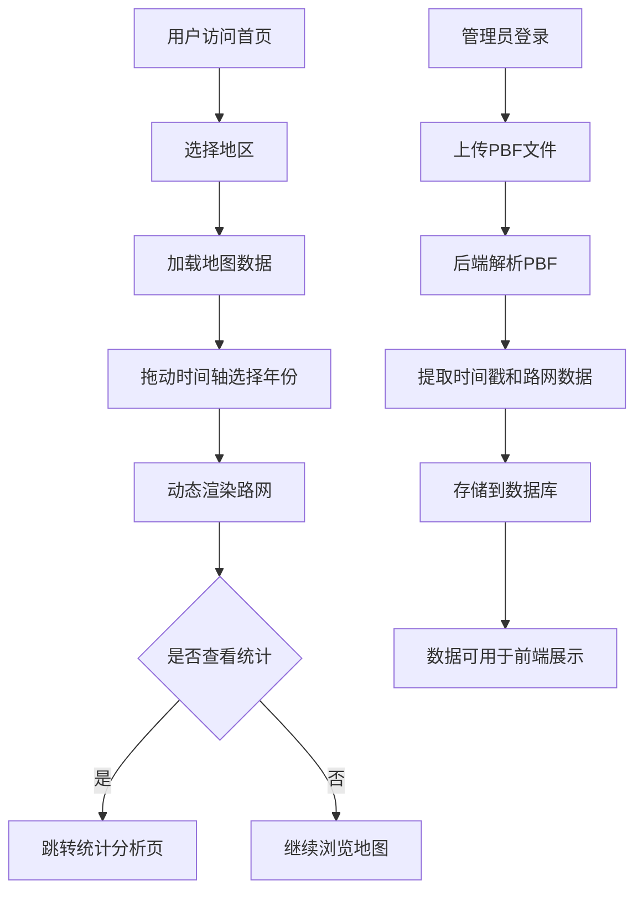

## 1. 产品概述

OSM历史路网可视化应用，用于展示OpenStreetMap历史数据中路网随时间的演变。通过时间轴和地图交互，用户可以直观查看不同年份道路的新增与消失情况，支持按地区筛选和分析路网变化趋势。

## 2. 核心功能

### 2.1 用户角色

| 角色 | 注册方式 | 核心权限 |
|------|----------|----------|
| 普通用户 | 无需注册 | 浏览地图、选择地区、查看历史路网演变 |
| 管理员 | 后台登录 | 上传PBF文件、管理数据、执行数据解析 |

### 2.2 功能模块

1. **地图主页**：Leaflet地图展示、时间轴控制、地区选择器
2. **数据管理页**：PBF文件上传、解析状态监控、数据库管理
3. **统计分析页**：路网增长趋势、新增/消失道路统计

### 2.3 页面详情

| 页面名称 | 模块名称 | 功能描述 |
|----------|----------|----------|
| 地图主页 | 地图展示区 | Leaflet加载OSM瓦片，支持缩放、平移 |
| 地图主页 | 时间轴控制器 | 按年份滑动，动态显示对应年份路网 |
| 地图主页 | 地区选择器 | 下拉选择目标地区，自动加载对应数据 |
| 地图主页 | 图例面板 | 显示新增道路、消失道路、现有道路图例 |
| 数据管理页 | 文件上传区 | 支持OSM PBF格式文件上传 |
| 数据管理页 | 解析任务列表 | 显示解析进度和状态 |
| 统计分析页 | 趋势图表 | 展示各年份道路数量变化趋势 |
| 统计分析页 | 数据表格 | 详细列出各年份新增/消失道路数量 |

## 3. 核心流程

## 4. 用户界面设计

### 4.1 设计风格

- **主色调**：深蓝色 (#165DFF) - 代表地图和科技感
- **辅助色**：绿色 (#00B42A) 表示新增道路，红色 (#F53F3F) 表示消失道路，灰色 (#86909C) 表示现有道路
- **按钮风格**：圆角矩形，悬浮效果，主按钮有轻微阴影
- **字体**：使用 Noto Sans SC 作为主要字体，标题加粗清晰
- **布局风格**：顶部导航栏 + 左侧控制面板 + 中央地图区的三栏布局
- **图标风格**：线性图标，与地图元素风格统一

### 4.2 页面设计概述

| 页面名称 | 模块名称 | UI元素 |
|----------|----------|--------|
| 地图主页 | 地图展示区 | 全屏Leaflet地图，深色底图突出道路颜色 |
| 地图主页 | 时间轴控制器 | 底部横向时间轴，带年份标记和播放按钮 |
| 地图主页 | 地区选择器 | 顶部下拉选择框，带搜索功能 |
| 地图主页 | 图例面板 | 右侧悬浮面板，半透明背景 |
| 数据管理页 | 文件上传区 | 拖拽上传区域，进度条显示 |
| 统计分析页 | 趋势图表 | ECharts折线图/柱状图组合 |

### 4.3 响应式

- 桌面端优先设计，适配1280px以上分辨率
- 平板端：左侧控制面板收起为侧边栏按钮
- 移动端：时间轴改为垂直布局，地图占满屏幕

### 4.4 交互动效

- 地图加载时有淡入效果
- 时间轴切换年份时道路有平滑过渡动画
- 悬停道路时高亮显示并显示详情tooltip
- 页面切换时有流畅的转场动画
