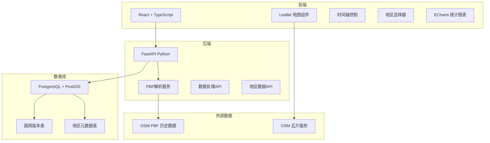
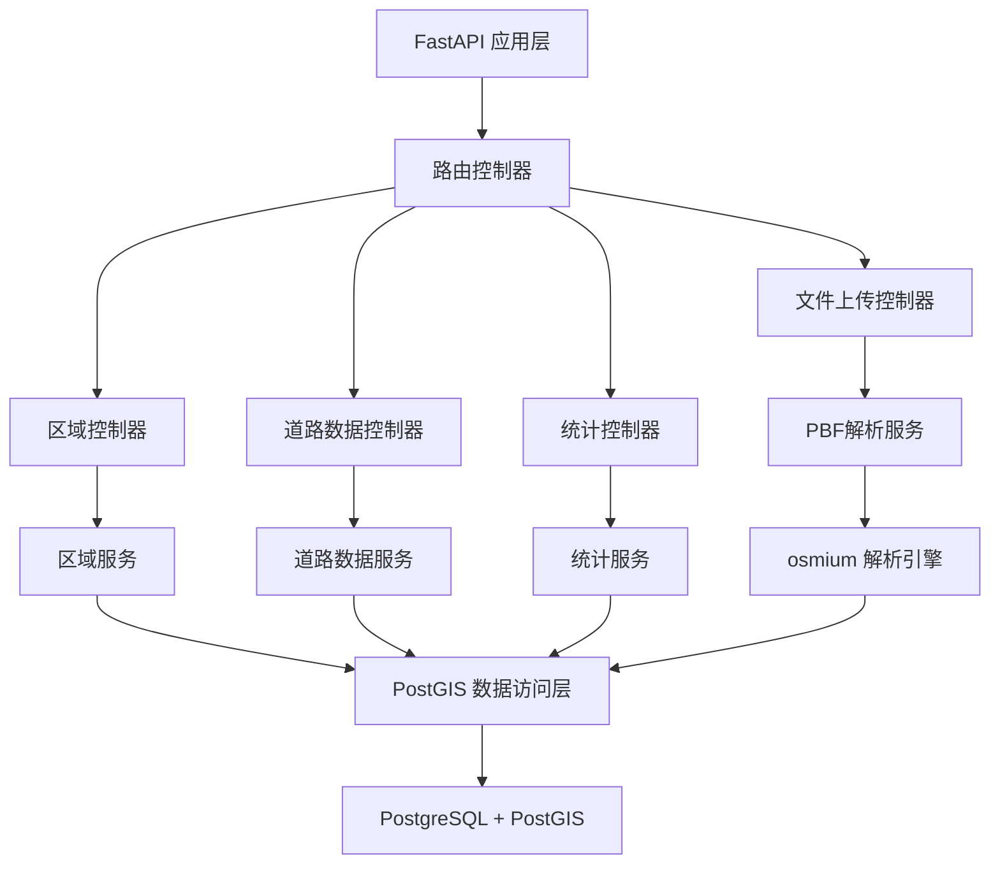
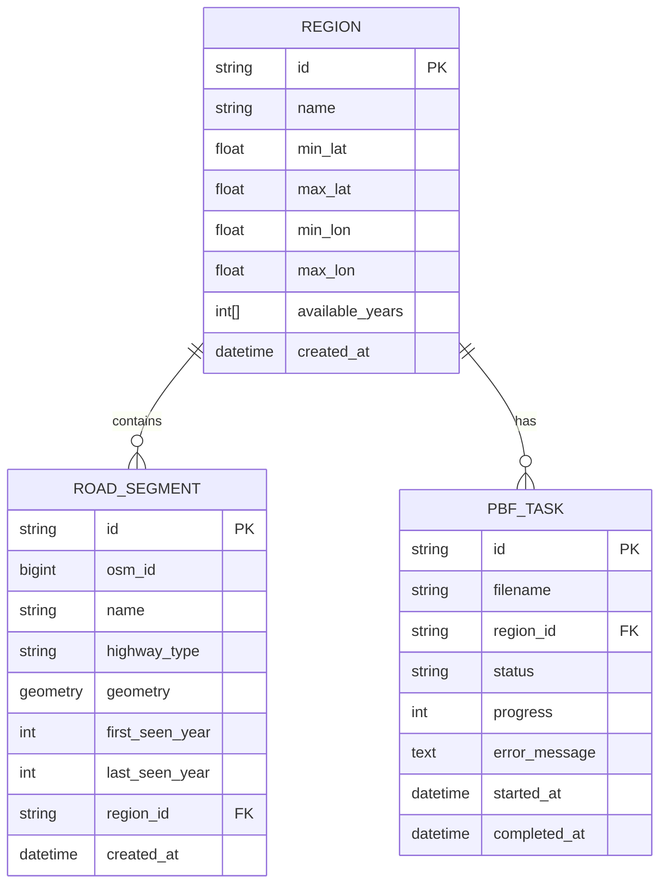

## 1. 架构设计



## 2. 技术描述

- **前端**：React@18 + TypeScript + Vite + tailwindcss@3
- **地图引擎**：Leaflet@1.9 + react-leaflet
- **图表库**：ECharts@5
- **后端**：FastAPI@0.100 (Python 3.11)
- **PBF解析**：osmium-tool + pyosmium
- **数据库**：PostgreSQL@15 + PostGIS@3
- **空间数据处理**：GeoPandas + Shapely

## 3. 路由定义

| 路由 | 用途 |
|------|------|
| / | 地图主页 - 核心可视化界面 |
| /admin | 数据管理页 - PBF上传和解析管理 |
| /stats | 统计分析页 - 路网演变统计 |

## 4. API 定义

```typescript
// 地区信息
interface Region {
  id: string;
  name: string;
  bbox: [number, number, number, number];
  availableYears: number[];
}

// 道路数据
interface RoadSegment {
  id: string;
  osmId: number;
  geometry: GeoJSON.LineString;
  name: string;
  highwayType: string;
  firstSeen: number;  // 首次出现年份
  lastSeen: number;   // 最后出现年份
  status: 'existing' | 'new' | 'disappeared';
}

// API Endpoints
GET /api/regions
  Response: Region[]

GET /api/roads?regionId={id}&year={year}
  Response: { type: 'FeatureCollection', features: RoadSegment[] }

GET /api/stats?regionId={id}
  Response: { year: number, newRoads: number, disappearedRoads: number, totalRoads: number }[]

POST /api/upload-pbf
  Request: FormData { file: File, regionId: string }
  Response: { taskId: string, status: 'pending' | 'processing' | 'completed' | 'error' }

GET /api/tasks/{taskId}
  Response: { taskId: string, status: string, progress: number, message: string }
```

## 5. 服务器架构图



## 6. 数据模型

### 6.1 数据模型定义



### 6.2 数据定义语言

```sql
-- 启用PostGIS扩展
CREATE EXTENSION IF NOT EXISTS postgis;
CREATE EXTENSION IF NOT EXISTS postgis_topology;

-- 区域表
CREATE TABLE regions (
    id VARCHAR(64) PRIMARY KEY,
    name VARCHAR(255) NOT NULL,
    min_lat FLOAT NOT NULL,
    max_lat FLOAT NOT NULL,
    min_lon FLOAT NOT NULL,
    max_lon FLOAT NOT NULL,
    available_years INTEGER[] DEFAULT '{}',
    created_at TIMESTAMP DEFAULT CURRENT_TIMESTAMP
);

-- 道路段表
CREATE TABLE road_segments (
    id VARCHAR(128) PRIMARY KEY,
    osm_id BIGINT NOT NULL,
    name VARCHAR(255),
    highway_type VARCHAR(64) NOT NULL,
    geometry GEOMETRY(LineString, 4326) NOT NULL,
    first_seen_year INTEGER NOT NULL,
    last_seen_year INTEGER NOT NULL,
    region_id VARCHAR(64) REFERENCES regions(id),
    created_at TIMESTAMP DEFAULT CURRENT_TIMESTAMP,
    INDEX idx_region (region_id),
    INDEX idx_year_range (first_seen_year, last_seen_year)
);

-- 空间索引
CREATE INDEX idx_road_geometry ON road_segments USING GIST (geometry);

-- PBF解析任务表
CREATE TABLE pbf_tasks (
    id VARCHAR(64) PRIMARY KEY,
    filename VARCHAR(255) NOT NULL,
    region_id VARCHAR(64) REFERENCES regions(id),
    status VARCHAR(32) NOT NULL DEFAULT 'pending',
    progress INTEGER DEFAULT 0,
    error_message TEXT,
    started_at TIMESTAMP,
    completed_at TIMESTAMP
);

-- 初始数据 - 示例区域
INSERT INTO regions (id, name, min_lat, max_lat, min_lon, max_lon) VALUES
('beijing', '北京市', 39.7, 40.1, 116.2, 116.6),
('shanghai', '上海市', 31.1, 31.4, 121.3, 121.6),
('guangzhou', '广州市', 23.0, 23.3, 113.2, 113.5);
```
