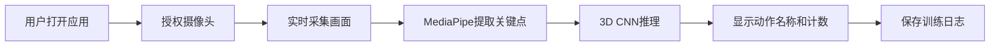

## 1. 产品概述

实时动作识别训练系统，通过MediaPipe提取人体33个骨架关键点，结合3D CNN深度学习模型识别健身动作（深蹲、俯卧撑等），实时显示动作名称和计数，并存储训练日志。

- 主要用途：AI健身教练、动作矫正、训练记录追踪
- 目标用户：健身爱好者、居家锻炼人群、康复训练患者
- 市场价值：降低专业健身门槛，提供实时反馈和数据化训练记录

## 2. 核心功能

### 2.1 用户角色

| 角色 | 注册方式 | 核心权限 |
|------|---------|---------|
| 普通用户 | 无需注册 | 实时动作识别、查看训练历史 |

### 2.2 功能模块

1. **实时识别页面**：摄像头预览、骨架可视化、动作名称显示、计数统计
2. **训练历史页面**：训练日志列表、统计图表、详细记录查看
3. **设置页面**：摄像头选择、灵敏度调节、模型参数配置

### 2.3 页面详情

| 页面名称 | 模块名称 | 功能描述 |
|---------|---------|---------|
| 实时识别 | 摄像头预览 | 实时显示摄像头画面，叠加骨架关键点 |
| 实时识别 | 动作识别 | 显示当前识别的动作名称，置信度百分比 |
| 实时识别 | 计数统计 | 深蹲、俯卧撑等动作的实时计数 |
| 训练历史 | 日志列表 | 按日期显示历史训练记录 |
| 训练历史 | 统计图表 | 训练次数、时长的可视化统计 |
| 设置 | 配置面板 | 摄像头设备选择、检测灵敏度调节 |

## 3. 核心流程

用户打开应用 → 授权摄像头权限 → 摄像头实时采集画面 → MediaPipe提取33个骨架关键点 → 关键点序列输入3D CNN模型 → 输出动作识别结果 → 实时显示动作名称和计数 → 训练结束保存日志到数据库

## 4. 用户界面设计

### 4.1 设计风格
- 主色调：深科技蓝 (#0F172A)，搭配霓虹青 (#06B6D4) 作为强调色
- 按钮风格：圆角胶囊按钮，发光悬停效果
- 字体：现代无衬线字体 - JetBrains Mono (代码/数字) + Inter (正文)
- 布局风格：深色模式，卡片式布局，玻璃态效果
- 图标风格：线性图标，霓虹发光效果

### 4.2 页面设计概述

| 页面名称 | 模块名称 | UI元素 |
|---------|---------|-------|
| 实时识别 | 主预览区 | 全屏摄像头画面，半透明骨架叠加，右上角状态面板 |
| 实时识别 | 数据面板 | 左侧动作名称大字体显示，右侧计数器数字动画 |
| 训练历史 | 时间线 | 垂直时间线布局，训练卡片悬浮效果 |
| 训练历史 | 图表区 | 渐变面积图展示训练趋势 |
| 设置 | 配置卡片 | 玻璃态卡片，滑块控件，开关动画 |

### 4.3 响应式设计
- 桌面端：左右分栏布局，主预览区占70%宽度
- 平板端：上下布局，预览区在上，数据面板在下
- 移动端：单列布局，优化触控区域

### 4.4 视觉特效
- 骨架关键点：发光圆点，连接线采用渐变效果
- 动作切换：平滑过渡动画，置信度进度条
- 计数增加：数字弹跳动画，粒子效果
- 背景：深色渐变 + 微妙网格纹理
