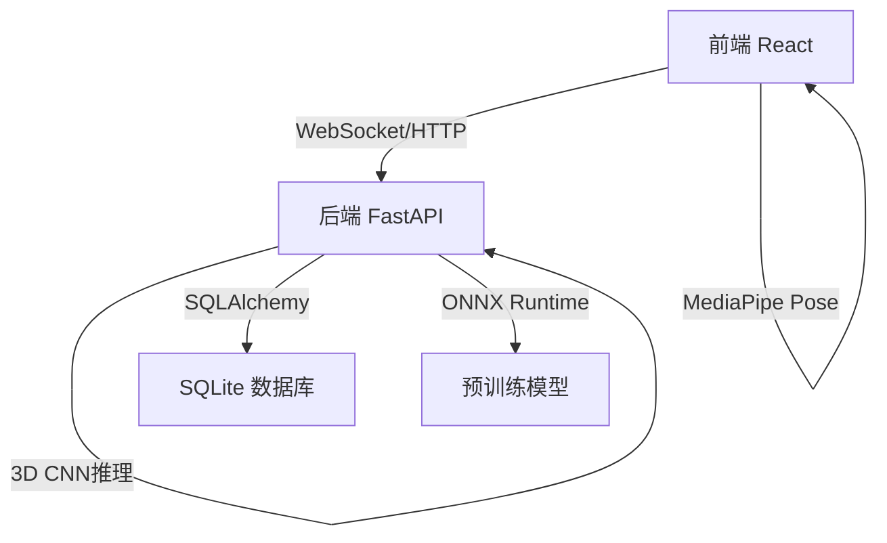
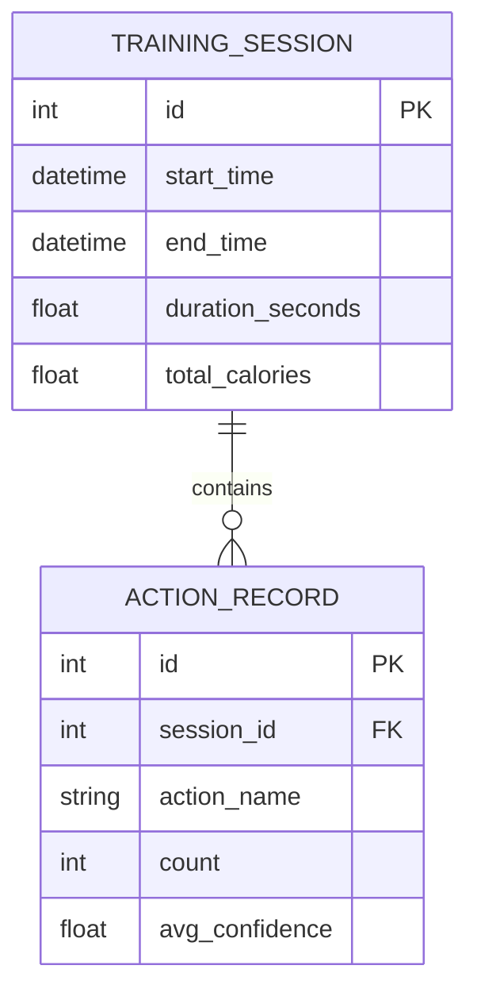

## 1. 架构设计



## 2. 技术描述

- **前端**: React@18 + TypeScript + Vite + TailwindCSS@3
- **状态管理**: Zustand
- **骨架提取**: @mediapipe/pose
- **后端**: FastAPI + Python 3.10+
- **深度学习推理**: ONNX Runtime
- **数据库**: SQLite + SQLAlchemy
- **实时通信**: WebSocket
- **图表**: recharts

## 3. 目录结构

```
p71/
├── frontend/
│   ├── src/
│   │   ├── components/
│   │   │   ├── CameraPreview.tsx
│   │   │   ├── PoseOverlay.tsx
│   │   │   ├── ActionCounter.tsx
│   │   │   └── TrainingHistory.tsx
│   │   ├── hooks/
│   │   │   ├── useCamera.ts
│   │   │   ├── useMediaPipe.ts
│   │   │   └── useActionRecognition.ts
│   │   ├── store/
│   │   │   └── trainingStore.ts
│   │   ├── pages/
│   │   │   ├── LiveRecognition.tsx
│   │   │   ├── History.tsx
│   │   │   └── Settings.tsx
│   │   └── types/
│   │       └── pose.ts
│   └── package.json
├── backend/
│   ├── app/
│   │   ├── api/
│   │   │   ├── recognition.py
│   │   │   └── training.py
│   │   ├── models/
│   │   │   ├── cnn3d.py
│   │   │   └── database.py
│   │   ├── services/
│   │   │   ├── pose_service.py
│   │   │   └── training_service.py
│   │   └── schemas/
│   │       ├── pose.py
│   │       └── training.py
│   ├── models/
│   │   └── action_recognition.onnx
│   └── main.py
└── README.md
```

## 4. 路由定义

### 前端路由

| 路由 | 页面 | 功能 |
|------|------|------|
| / | 实时识别 | 摄像头预览、动作识别、计数 |
| /history | 训练历史 | 查看历史训练记录和统计 |
| /settings | 设置 | 摄像头和识别参数配置 |

### 后端API

| 方法 | 路由 | 功能 |
|------|------|------|
| POST | /api/recognize | 识别动作序列 |
| GET | /api/training | 获取训练日志列表 |
| POST | /api/training | 保存训练记录 |
| GET | /api/training/{id} | 获取单条训练详情 |
| DELETE | /api/training/{id} | 删除训练记录 |
| WS | /ws/pose | 实时关键点传输 |

## 5. API定义

### Pose数据结构

```typescript
// 33个关键点
interface PoseLandmark {
  x: number;      // 0-1
  y: number;      // 0-1
  z: number;      // 相对深度
  visibility: number;  // 可见度 0-1
}

interface PoseFrame {
  timestamp: number;
  landmarks: PoseLandmark[];
}

interface ActionRecognitionRequest {
  frames: PoseFrame[];  // 连续16帧
}

interface ActionRecognitionResponse {
  action: string;       // 'squat', 'pushup', 'none'
  confidence: number;   // 0-1
  count: number;        // 当前动作计数
}

interface TrainingLog {
  id: number;
  startTime: string;
  endTime: string;
  actions: {
    name: string;
    count: number;
  }[];
  totalCalories: number;
}
```

## 6. 数据模型

### 6.1 ER图



### 6.2 DDL

```sql
CREATE TABLE training_session (
    id INTEGER PRIMARY KEY AUTOINCREMENT,
    start_time DATETIME NOT NULL,
    end_time DATETIME,
    duration_seconds REAL DEFAULT 0,
    total_calories REAL DEFAULT 0
);

CREATE TABLE action_record (
    id INTEGER PRIMARY KEY AUTOINCREMENT,
    session_id INTEGER NOT NULL,
    action_name VARCHAR(50) NOT NULL,
    count INTEGER DEFAULT 0,
    avg_confidence REAL DEFAULT 0,
    FOREIGN KEY (session_id) REFERENCES training_session(id)
);

CREATE INDEX idx_session_time ON training_session(start_time);
CREATE INDEX idx_action_session ON action_record(session_id);
```

## 7. 3D CNN模型说明

- **输入**: (batch, 16, 33, 3) - 16帧序列，每帧33个关键点，每个点3个坐标(x,y,z)
- **输出**: 动作类别概率分布
- **支持动作**:
  - 深蹲 (squat)
  - 俯卧撑 (pushup)
  - 站立 (stand)
  - 无动作 (none)
- **推理框架**: ONNX Runtime
- **推理延迟**: < 50ms
