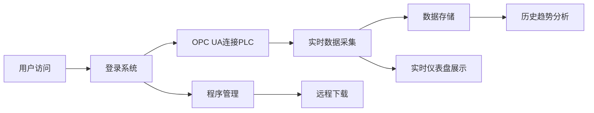

# OPC UA 工业监控仪表盘 - 产品需求文档

## 1. 产品概述
本项目是一个工业监控Web应用，通过OPC UA协议连接PLC设备（仿真模式），实时采集温度、压力等工业数据，提供可视化仪表盘展示，并支持历史数据趋势分析和远程程序下载功能。
- **核心目标**：实现工业设备数据的实时监控、历史存储和远程管理
- **目标用户**：工业自动化工程师、设备运维人员、生产管理人员

## 2. 核心功能

### 2.1 用户角色
| 角色 | 登录方式 | 核心权限 |
|------|---------|---------|
| 管理员 | 用户名密码登录 | 实时监控、历史数据查询、远程下载程序、系统配置 |
| 访客 | 无/只读访问 | 实时数据查看、历史趋势浏览 |

### 2.2 功能模块
1. **仪表盘页面**：实时数据展示、设备状态监控、告警提示
2. **历史趋势页面**：数据图表展示、时间范围筛选、数据导出
3. **程序管理页面**：程序文件上传、远程下载、版本管理
4. **系统配置页面**：OPC UA连接配置、数据采集频率设置

### 2.3 页面详情
| 页面名称 | 模块名称 | 功能描述 |
|---------|---------|---------|
| 仪表盘 | 实时数据卡片 | 温度、压力实时数值显示，单位和状态标识 |
| 仪表盘 | 实时曲线图 | 最近5分钟数据动态刷新图表 |
| 仪表盘 | 设备状态面板 | PLC连接状态、运行状态、告警信息 |
| 历史趋势 | 趋势图表 | 可缩放的历史数据折线图，支持多指标对比 |
| 历史趋势 | 时间筛选器 | 自定义时间范围、快速选择（今天/本周/本月） |
| 程序管理 | 文件列表 | 已上传程序文件列表，版本号、上传时间 |
| 程序管理 | 下载操作 | 触发远程下载，下载进度显示 |

## 3. 核心流程

用户访问应用 → 系统自动连接OPC UA服务器 → 实时采集PLC数据 → 前端实时更新仪表盘 → 用户查看历史趋势 → 管理员进行远程下载程序

## 4. 用户界面设计

### 4.1 设计风格
- **主色调**：深蓝科技蓝 (#0F172A) 作为主背景，突出工业科技感
- **强调色**：青色 (#06B6D4) 用于数据高亮，绿色 (#10B981) 表示正常，红色 (#EF4444) 表示告警
- **按钮风格**：圆角设计，带有微妙阴影，悬停动画效果
- **字体**：使用 JetBrains Mono 等宽字体展示数值，Inter 用于正文
- **布局风格**：卡片式网格布局，左侧导航栏，顶部状态栏
- **图标风格**：线性简约图标，工业设备主题

### 4.2 页面设计概览
| 页面名称 | 模块名称 | UI元素 |
|---------|---------|--------|
| 仪表盘 | 数据卡片 | 深色背景、霓虹发光效果、动态数值动画 |
| 仪表盘 | 实时曲线 | 平滑过渡动画、渐变填充、实时数据点 |
| 历史趋势 | 图表区 | 可交互图表、缩放拖拽、图例切换 |
| 程序管理 | 文件列表 | 表格布局、操作按钮、进度条 |

### 4.3 响应式设计
- 桌面端优先，支持1920×1080及以上分辨率
- 平板端自适应布局，卡片重新排列
- 移动端简化显示核心数据卡片

### 4.4 动效设计
- 数据数值变化时平滑过渡动画
- 页面加载时元素渐入效果
- 告警状态闪烁提醒
- 按钮悬停微动画
