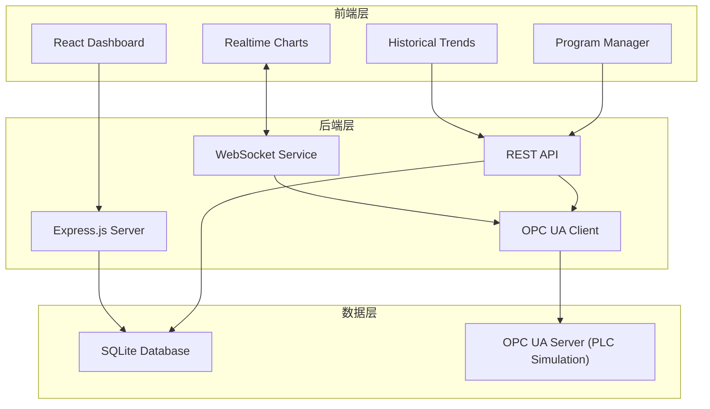
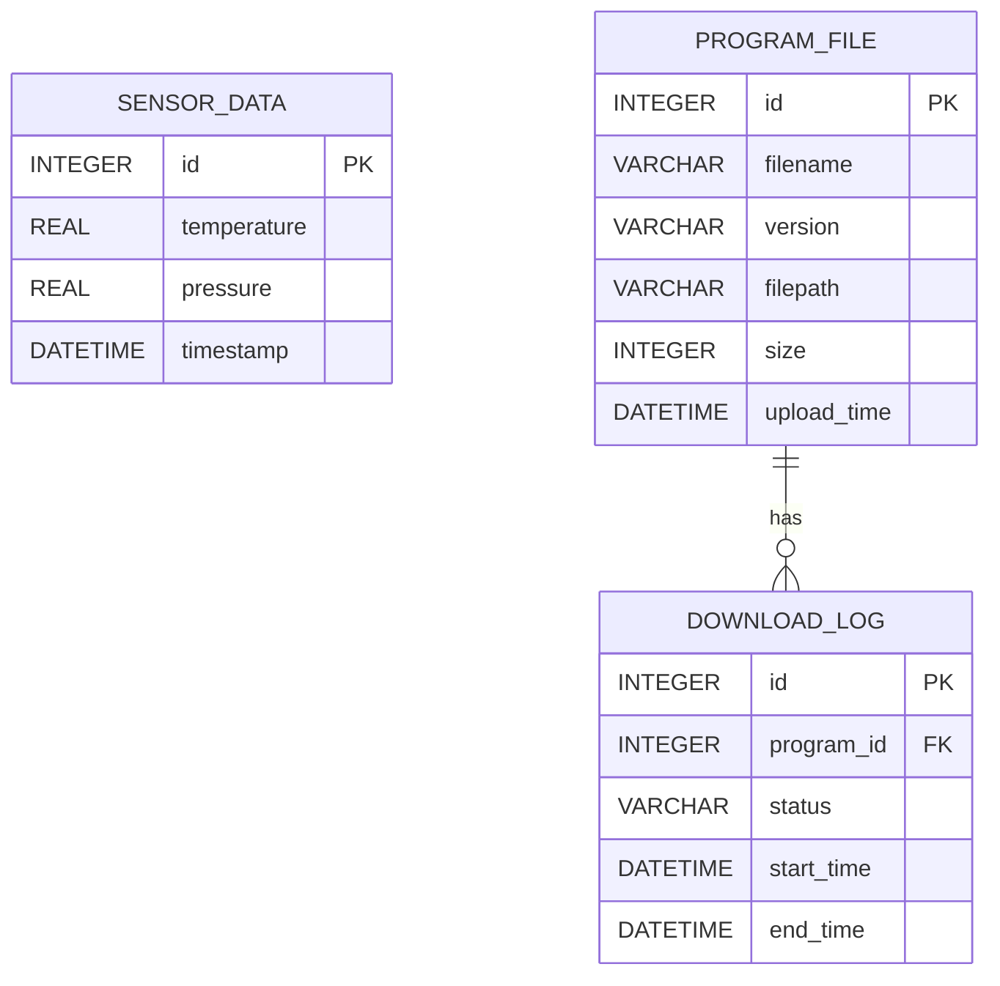

# OPC UA 工业监控仪表盘 - 技术架构文档

## 1. 架构设计



## 2. 技术栈说明

### 2.1 前端技术
- **框架**: React 18 + TypeScript
- **构建工具**: Vite 5
- **样式**: TailwindCSS 3
- **图表库**: Recharts / Chart.js
- **状态管理**: React Hooks (useState, useEffect, useContext)
- **实时通信**: Socket.io-client
- **路由**: React Router v6

### 2.2 后端技术
- **运行时**: Node.js 20+
- **Web框架**: Express.js 4
- **OPC UA**: node-opcua (OPC UA协议实现)
- **实时通信**: Socket.io
- **数据库**: SQLite + better-sqlite3
- **文件上传**: Multer

### 2.3 OPC UA 仿真
- 使用 node-opcua 创建仿真 OPC UA 服务器
- 模拟 PLC 设备数据点（温度、压力）
- 数据定期随机波动，模拟真实工业场景

## 3. 目录结构

```
project-root/
├── backend/
│   ├── src/
│   │   ├── opcua/          # OPC UA 服务器和客户端
│   │   ├── database/       # 数据库操作
│   │   ├── routes/         # API 路由
│   │   ├── websocket/      # WebSocket 处理
│   │   └── server.ts       # 服务器入口
│   ├── uploads/            # 程序文件存储
│   └── package.json
├── frontend/
│   ├── src/
│   │   ├── components/     # React 组件
│   │   ├── pages/          # 页面组件
│   │   ├── hooks/          # 自定义 Hooks
│   │   ├── services/       # API 和 WebSocket 服务
│   │   └── App.tsx
│   └── package.json
└── README.md
```

## 4. 路由定义

### 4.1 前端路由
| 路由 | 页面 | 功能 |
|------|------|------|
| / | 仪表盘 | 实时数据展示 |
| /history | 历史趋势 | 历史数据图表 |
| /programs | 程序管理 | 文件上传下载 |
| /settings | 系统设置 | 连接配置 |

### 4.2 后端 API 路由
| 方法 | 路径 | 功能 |
|------|------|------|
| GET | /api/data/realtime | 获取当前实时数据 |
| GET | /api/data/history | 获取历史数据（带时间参数） |
| GET | /api/plc/status | 获取PLC连接状态 |
| GET | /api/programs | 获取程序列表 |
| POST | /api/programs/upload | 上传程序文件 |
| POST | /api/programs/:id/download | 触发远程下载 |
| GET | /api/programs/:id/download/status | 获取下载状态 |

## 5. WebSocket 事件

| 事件名 | 方向 | 说明 |
|--------|------|------|
| data:update | 服务器→客户端 | 实时数据更新推送 |
| plc:status | 服务器→客户端 | PLC状态变化通知 |
| download:progress | 服务器→客户端 | 下载进度更新 |

## 6. 数据模型

### 6.1 ER 图



### 6.2 数据库表结构

```sql
-- 传感器数据表
CREATE TABLE sensor_data (
    id INTEGER PRIMARY KEY AUTOINCREMENT,
    temperature REAL NOT NULL,
    pressure REAL NOT NULL,
    timestamp DATETIME DEFAULT CURRENT_TIMESTAMP
);

CREATE INDEX idx_sensor_data_timestamp ON sensor_data(timestamp);

-- 程序文件表
CREATE TABLE program_files (
    id INTEGER PRIMARY KEY AUTOINCREMENT,
    filename VARCHAR(255) NOT NULL,
    version VARCHAR(50) NOT NULL,
    filepath VARCHAR(500) NOT NULL,
    size INTEGER NOT NULL,
    upload_time DATETIME DEFAULT CURRENT_TIMESTAMP
);

-- 下载记录表
CREATE TABLE download_logs (
    id INTEGER PRIMARY KEY AUTOINCREMENT,
    program_id INTEGER NOT NULL,
    status VARCHAR(20) DEFAULT 'pending',
    progress INTEGER DEFAULT 0,
    start_time DATETIME,
    end_time DATETIME,
    FOREIGN KEY (program_id) REFERENCES program_files(id)
);
```

## 7. OPC UA 节点定义

OPC UA 服务器将暴露以下节点：

| 节点路径 | 类型 | 说明 |
|----------|------|------|
| ns=1;s=Temperature | Double | 温度值 (°C) |
| ns=1;s=Pressure | Double | 压力值 (MPa) |
| ns=1;s=Status | Boolean | 设备运行状态 |
| ns=1;s=Alarm | Boolean | 告警状态 |

## 8. 性能优化

- 使用 WebSocket 推送实时数据，减少轮询开销
- 历史数据查询分页和时间范围限制
- 数据库定期清理过期数据
- 前端图表虚拟滚动和数据采样
