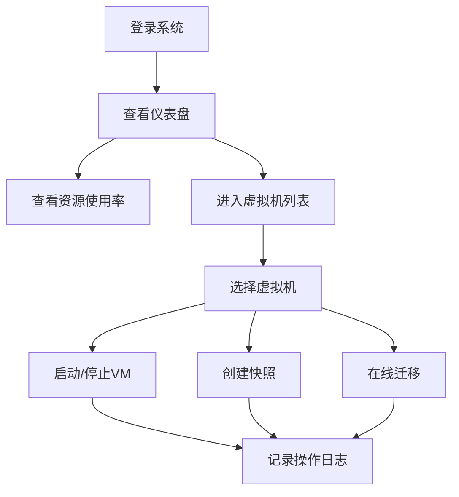

## 1. 产品概述

ProxMox虚拟机管理平台是一个基于Web的虚拟化管理工具，通过调用ProxMox VE API实现虚拟机的全生命周期管理。平台支持多节点集群管理，提供实时资源监控仪表盘，并记录所有操作日志用于审计追踪。

- 核心目标：简化虚拟机管理流程，提供直观的资源可视化界面
- 目标用户：系统管理员、DevOps工程师、云平台运维人员
- 产品价值：统一管理入口，降低运维复杂度，提升资源利用率

## 2. 核心功能

### 2.1 用户角色

| 角色 | 注册方式 | 核心权限 |
|------|----------|----------|
| 管理员 | 系统配置 | 虚拟机全生命周期管理、集群配置、日志查看 |
| 普通用户 | 管理员创建 | 虚拟机查看、启停操作、快照管理 |

### 2.2 功能模块

1. **仪表盘页面**：集群概览、资源使用率图表、节点状态
2. **虚拟机管理**：VM列表、创建/启动/停止/重启、控制台访问
3. **快照管理**：快照创建、恢复、删除
4. **迁移管理**：在线迁移、节点选择
5. **操作日志**：操作记录、筛选查询、导出
6. **集群管理**：节点列表、节点状态、资源统计

### 2.3 页面详情

| 页面名称 | 模块名称 | 功能描述 |
|-----------|-------------|---------------------|
| 仪表盘 | 资源概览 | CPU/内存/存储使用率实时图表，节点状态卡片 |
| 仪表盘 | 集群状态 | 多节点健康状态展示，在线/离线节点统计 |
| 虚拟机列表 | VM表格 | 展示所有虚拟机，支持筛选和排序 |
| 虚拟机详情 | 操作面板 | 启动/停止/重启/控制台/快照/迁移操作 |
| 创建虚拟机 | 表单向导 | 配置VM参数：名称、OS、CPU、内存、磁盘、网络 |
| 快照管理 | 快照列表 | 创建、恢复、删除快照，显示快照时间和大小 |
| 迁移管理 | 迁移表单 | 选择目标节点，执行在线迁移 |
| 操作日志 | 日志表格 | 记录所有操作，支持按时间/用户/类型筛选 |
| 集群管理 | 节点列表 | 展示集群节点信息，资源使用率统计 |

## 3. 核心流程

用户登录系统后，首先在仪表盘查看集群整体资源状态。可以通过虚拟机列表选择特定VM进行操作，包括启动、停止、创建快照或在线迁移。所有操作均被记录到操作日志中。

## 4. 用户界面设计

### 4.1 设计风格

- **主色调**：深蓝色 (#1e3a5f) 代表专业和可信赖
- **辅助色**：青色 (#0ea5e9) 用于强调和交互元素
- **成功色**：绿色 (#22c55e) 表示运行中/成功
- **警告色**：橙色 (#f97316) 表示警告状态
- **危险色**：红色 (#ef4444) 表示停止/错误
- **按钮风格**：圆角中等 (8px)，轻微阴影，悬停时高亮
- **字体**：Inter + JetBrains Mono（代码）
- **布局风格**：侧边栏导航 + 卡片式内容区，网格布局
- **图标**：Lucide React 线性图标风格

### 4.2 页面设计概述

| 页面名称 | 模块名称 | UI 元素 |
|-----------|-------------|-------------|
| 仪表盘 | 资源概览 | 响应式网格、渐变图表卡片、实时数据动画 |
| 仪表盘 | 节点状态 | 彩色状态指示器、悬停详情弹窗 |
| 虚拟机列表 | VM表格 | 斑马纹表格、操作按钮组、状态标签 |
| 创建虚拟机 | 表单向导 | 分步导航、表单验证、进度指示器 |
| 操作日志 | 日志表格 | 时间线布局、筛选器、分页 |

### 4.3 响应式设计

- 桌面端 (1280px+)：完整侧边栏 + 多列网格布局
- 平板 (768px-1279px)：折叠侧边栏 + 双列布局
- 移动端 (<768px)：汉堡菜单 + 单列布局，触摸优化

### 4.4 交互动效

- 页面加载：元素渐入 + 轻微上移动画
- 卡片悬停：轻微上浮 + 阴影增强
- 按钮点击：缩放反馈
- 数据更新：数字平滑过渡动画
- 状态变更：颜色渐变过渡
