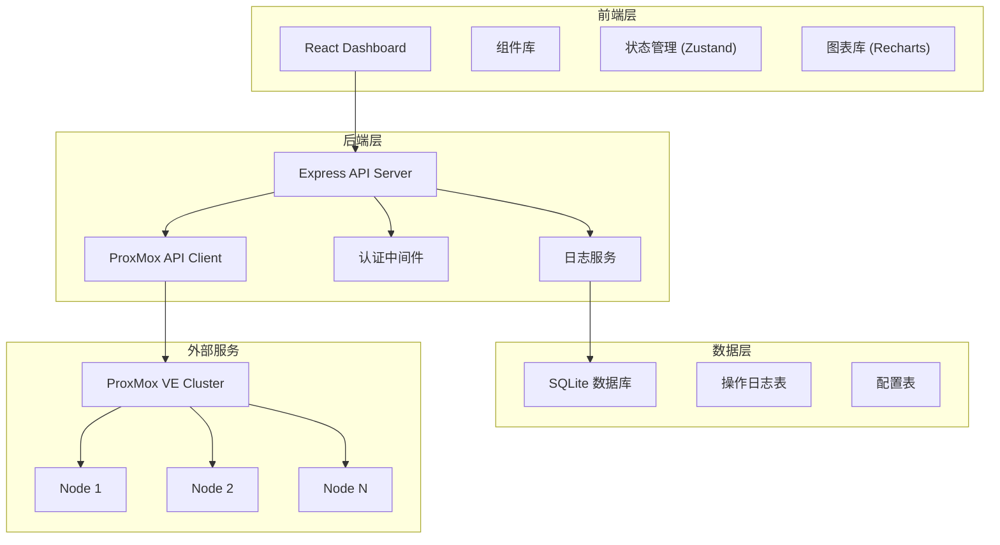
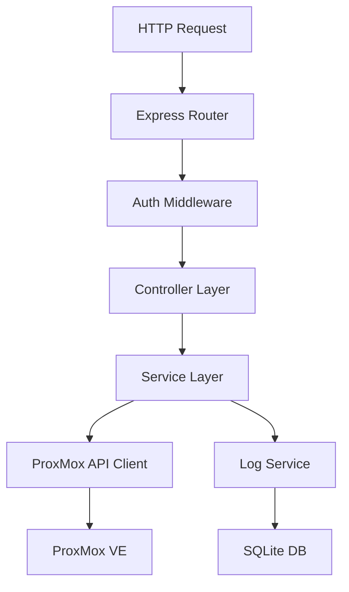
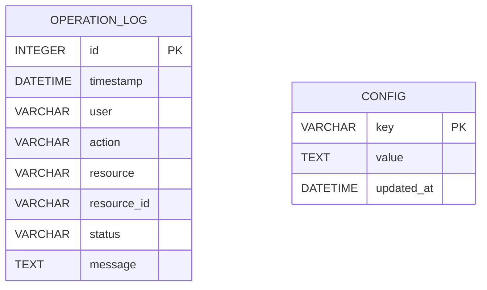

## 1. 架构设计



## 2. 技术栈说明

### 前端技术
- **框架**：React 18 + TypeScript
- **构建工具**：Vite
- **样式方案**：Tailwind CSS 3
- **状态管理**：Zustand
- **路由管理**：React Router DOM
- **图表库**：Recharts
- **UI 组件**：Lucide React 图标
- **HTTP 客户端**：Axios

### 后端技术
- **运行时**：Node.js 18+
- **Web 框架**：Express 4
- **类型系统**：TypeScript
- **ProxMox API**：proxmox-api 客户端
- **数据库**：SQLite (better-sqlite3)
- **认证**：JWT (jsonwebtoken)

## 3. 路由定义

### 前端路由

| 路由路径 | 页面名称 | 说明 |
|----------|----------|------|
| /dashboard | 仪表盘 | 资源概览和集群状态 |
| /vms | 虚拟机列表 | 所有VM的列表展示 |
| /vms/create | 创建虚拟机 | VM创建表单向导 |
| /vms/:id | 虚拟机详情 | 单个VM的详情和操作 |
| /vms/:id/snapshots | 快照管理 | VM快照列表和操作 |
| /vms/:id/migrate | 迁移管理 | 在线迁移表单 |
| /logs | 操作日志 | 操作记录查询 |
| /cluster | 集群管理 | 节点列表和状态 |
| /settings | 设置 | 系统配置 |

### 后端 API 路由

| 方法 | 路径 | 说明 |
|------|------|------|
| GET | /api/nodes | 获取节点列表 |
| GET | /api/nodes/:node/status | 获取节点状态 |
| GET | /api/vms | 获取所有虚拟机 |
| GET | /api/vms/:id | 获取虚拟机详情 |
| POST | /api/vms | 创建虚拟机 |
| POST | /api/vms/:id/start | 启动虚拟机 |
| POST | /api/vms/:id/stop | 停止虚拟机 |
| POST | /api/vms/:id/restart | 重启虚拟机 |
| GET | /api/vms/:id/snapshots | 获取快照列表 |
| POST | /api/vms/:id/snapshots | 创建快照 |
| POST | /api/vms/:id/snapshots/:snapname/rollback | 恢复快照 |
| DELETE | /api/vms/:id/snapshots/:snapname | 删除快照 |
| POST | /api/vms/:id/migrate | 在线迁移 |
| GET | /api/logs | 获取操作日志 |
| POST | /api/auth/login | 用户登录 |

## 4. API 定义

### 类型定义

```typescript
// 虚拟机信息
interface VirtualMachine {
  vmid: number;
  name: string;
  node: string;
  status: 'running' | 'stopped' | 'paused';
  cpu: number;
  memory: number;
  disk: number;
  netin: number;
  netout: number;
  uptime: number;
}

// 节点信息
interface ClusterNode {
  node: string;
  status: 'online' | 'offline';
  cpu: number;
  mem: number;
  maxcpu: number;
  maxmem: number;
  disk: number;
  maxdisk: number;
  uptime: number;
}

// 快照信息
interface Snapshot {
  name: string;
  description: string;
  time: number;
  vmstate: boolean;
  parent: string;
}

// 操作日志
interface OperationLog {
  id: number;
  timestamp: string;
  user: string;
  action: string;
  resource: string;
  resourceId: string;
  status: 'success' | 'failed';
  message: string;
}

// 创建VM参数
interface CreateVMParams {
  node: string;
  vmid: number;
  name: string;
  cores: number;
  memory: number;
  disk: number;
  ostype: string;
  net0: string;
}
```

## 5. 服务器架构



### 目录结构

```
api/
├── src/
│   ├── controllers/
│   │   ├── vm.controller.ts
│   │   ├── node.controller.ts
│   │   ├── snapshot.controller.ts
│   │   ├── migrate.controller.ts
│   │   └── log.controller.ts
│   ├── services/
│   │   ├── proxmox.service.ts
│   │   └── log.service.ts
│   ├── middleware/
│   │   └── auth.middleware.ts
│   ├── models/
│   │   └── database.ts
│   ├── routes/
│   │   ├── vm.routes.ts
│   │   ├── node.routes.ts
│   │   └── log.routes.ts
│   ├── types/
│   │   └── index.ts
│   ├── config/
│   │   └── index.ts
│   └── index.ts
└── package.json
```

## 6. 数据模型

### 6.1 ER 图



### 6.2 DDL 语句

```sql
-- 操作日志表
CREATE TABLE IF NOT EXISTS operation_logs (
    id INTEGER PRIMARY KEY AUTOINCREMENT,
    timestamp DATETIME DEFAULT CURRENT_TIMESTAMP,
    user VARCHAR(100) NOT NULL,
    action VARCHAR(50) NOT NULL,
    resource VARCHAR(50) NOT NULL,
    resource_id VARCHAR(100),
    status VARCHAR(20) NOT NULL,
    message TEXT
);

CREATE INDEX idx_logs_timestamp ON operation_logs(timestamp);
CREATE INDEX idx_logs_action ON operation_logs(action);
CREATE INDEX idx_logs_user ON operation_logs(user);

-- 配置表
CREATE TABLE IF NOT EXISTS config (
    key VARCHAR(100) PRIMARY KEY,
    value TEXT,
    updated_at DATETIME DEFAULT CURRENT_TIMESTAMP
);

-- 初始配置数据
INSERT INTO config (key, value) VALUES 
    ('proxmox_host', 'https://localhost:8006'),
    ('proxmox_user', 'root@pam'),
    ('jwt_secret', 'your-secret-key-here');
```
