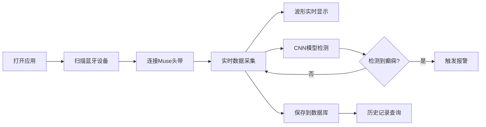

## 1. 产品概述

EEG癫痫检测Web应用，通过Web Bluetooth技术连接Muse等EEG头带设备，实时采集脑电数据并使用预训练的CNN模型进行癫痫样放电检测，前端实时显示脑电波形并在检测到异常时触发报警，数据库存储所有训练和检测记录。

- 主要用途：实时癫痫监测与预警系统
- 目标用户：癫痫患者、医疗机构、研究人员
- 核心价值：非侵入式实时脑电监测，自动癫痫预警

## 2. 核心功能

### 2.1 用户角色
| 角色 | 注册方式 | 核心权限 |
|------|---------|----------|
| 普通用户 | 无需注册 | 连接设备、实时监测、查看历史记录 |

### 2.2 功能模块
1. **设备连接页面**：蓝牙设备扫描、连接状态显示
2. **实时监测页面**：脑电波形显示、癫痫检测报警、数据统计
3. **历史记录页面**：训练/检测记录列表、详情查看、数据导出

### 2.3 页面详情
| 页面名称 | 模块名称 | 功能描述 |
|---------|----------|----------|
| 设备连接页 | 设备扫描 | 蓝牙设备发现、Muse头带配对 |
| 设备连接页 | 连接状态 | 信号强度、电池电量、连接控制 |
| 实时监测页 | 波形显示 | 多通道EEG波形实时绘制、可缩放 |
| 实时监测页 | 异常检测 | CNN模型实时推理、癫痫样放电报警 |
| 实时监测页 | 报警系统 | 视觉闪烁、声音警报、阈值设置 |
| 历史记录页 | 记录列表 | 时间筛选、记录搜索、分页浏览 |
| 历史记录页 | 详情查看 | 波形回放、检测结果统计、数据导出 |

## 3. 核心流程

用户打开应用 → 扫描并连接EEG头带设备 → 进入实时监测页面 → 脑电数据实时采集与显示 → 后端CNN模型实时检测 → 检测到异常时触发报警 → 所有数据自动保存到数据库 → 可在历史记录中查看和导出

## 4. 用户界面设计

### 4.1 设计风格
- 主色调：深蓝色系（#1a365d）代表科技与医疗专业感
- 辅助色：绿色（#10b981）正常状态，红色（#ef4444）报警状态
- 按钮风格：圆角胶囊按钮，悬停有微动画效果
- 字体：使用Roboto Mono显示波形数据，Inter作为界面字体
- 布局风格：卡片式布局，深色主题，科技感线条装饰
- 图标风格：使用lucide-react线性图标

### 4.2 页面设计概述
| 页面名称 | 模块名称 | UI元素 |
|---------|----------|--------|
| 设备连接页 | 设备扫描 | 扫描动画、设备卡片、信号条 |
| 实时监测页 | 波形显示 | Canvas画布、通道标签、时间轴 |
| 实时监测页 | 报警区域 | 状态指示灯、报警计数器、静音按钮 |
| 历史记录页 | 记录列表 | 时间线布局、状态徽章、详情弹窗 |

### 4.3 响应式
- Desktop-first设计，适配1024px以上屏幕
- 波形显示区域自适应宽度
- 移动端简化显示通道数量
