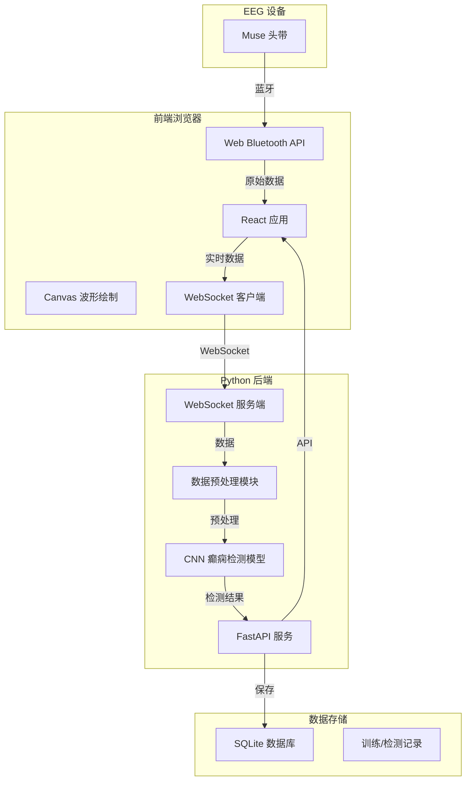
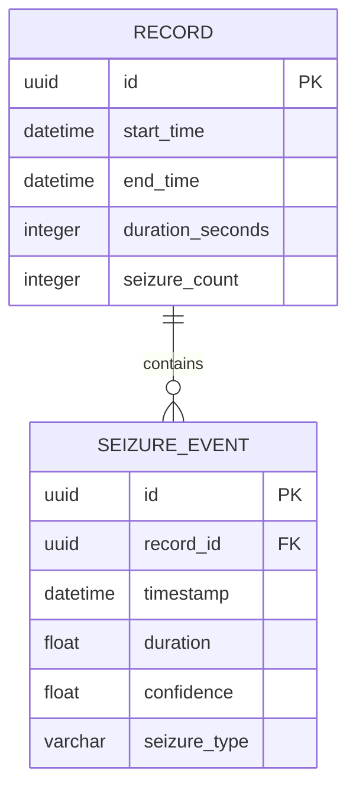

## 1. 架构设计



## 2. 技术描述

### 2.1 技术栈
- **前端**: React@18 + TypeScript + Vite + TailwindCSS@3 + Zustand
- **后端**: Python 3.10 + FastAPI + WebSockets + TensorFlow/PyTorch
- **数据库**: SQLite + SQLAlchemy ORM
- **设备通信**: Web Bluetooth API (GATT协议)

### 2.2 核心依赖
- 前端: lucide-react, chart.js/Canvas API, websocket
- 后端: uvicorn, sqlalchemy, numpy, scipy, tensorflow

## 3. 路由定义

| 路由 | 用途 |
|------|------|
| / | 设备连接页面 |
| /monitor | 实时监测页面 |
| /history | 历史记录页面 |

## 4. API 定义

### 4.1 WebSocket API
```typescript
// 前端发送数据
interface EEGDataPacket {
  timestamp: number;
  channelData: number[]; // 4通道数据
  samplingRate: number;
}

// 后端返回检测结果
interface DetectionResult {
  timestamp: number;
  isSeizure: boolean;
  confidence: number;
  seizureType?: string;
}
```

### 4.2 REST API
```typescript
// 获取历史记录
GET /api/records?page=1&limit=20
Response: {
  records: Array<{
    id: string;
    startTime: string;
    endTime: string;
    seizureCount: number;
    duration: number;
  }>;
  total: number;
}

// 获取单条记录详情
GET /api/records/:id
Response: {
  id: string;
  startTime: string;
  endTime: string;
  seizureEvents: Array<{timestamp: number; duration: number; confidence: number}>;
  eegPreview: number[][];
}

// 保存记录
POST /api/records
Request: {
  startTime: string;
  endTime: string;
  eegData: number[][];
  detectionResults: DetectionResult[];
}
```

## 5. 数据模型

### 5.1 ER图


### 5.2 DDL
```sql
CREATE TABLE records (
    id TEXT PRIMARY KEY,
    start_time DATETIME NOT NULL,
    end_time DATETIME NOT NULL,
    duration_seconds INTEGER NOT NULL,
    seizure_count INTEGER DEFAULT 0,
    created_at DATETIME DEFAULT CURRENT_TIMESTAMP
);

CREATE TABLE seizure_events (
    id TEXT PRIMARY KEY,
    record_id TEXT NOT NULL,
    timestamp DATETIME NOT NULL,
    duration REAL NOT NULL,
    confidence REAL NOT NULL,
    seizure_type TEXT,
    FOREIGN KEY (record_id) REFERENCES records(id) ON DELETE CASCADE
);

CREATE INDEX idx_records_start_time ON records(start_time);
CREATE INDEX idx_seizure_events_record_id ON seizure_events(record_id);
```
